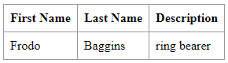

# Class Assignment 1: Introduction to Git

## Overview

The goal of this class assignment was to learn how to use Git, using GitHub as the hosting platform.  
New concepts such as _**clone**_, _**commit**_, _**push**_, _**pull**_, _**tag**_, _**branch**_ and _**merge**_ were 
explored.
To support the assignment, a web application was provided and the source code is available [**here**](https://github.com/spring-guides/tut-react-and-spring-data-rest).  
  
**For this assignment two main distinct sections were required:**  
* Development of new features for a web application using different branches in Git;  
* Explore an alternative Version Control System.

**Important notes:**  
* Main tasks were identified and issues were created in accordance on GitHub. Once the issue was solved, 
it was closed and linked to a specific commit (The web version of GitHub was used);
* Annotated tags were used to mark the versions of the application. 
A pattern like major.minor.revision (e.g., 1.1.0) was adopted.
The repository containing all the work developed using **Git** can be found [**here**](https://github.com/MarianaPereira7/devops-23-24-JPE-PSM-1231844).

---

## Table of Contents

1. [Git: How to Get Started](#1-git-how-to-get-started)
2. [How to Create Issues on GitHub](#2-how-to-create-issues-on-github)
3. [Assignment Tasks](#3-assignment-tasks)
   - [Part 1: Development of a New Feature Using the Main Branch](#part-1-development-of-a-new-feature-using-the-main-branch)
   - [Part 2: Development of New Features Using Separate Branches](#part-2-development-of-new-features-using-separate-branches)
     - [Part 2.1: Email-field Branch](#part-2.1-email-field-branch)
     - [Part 2.2: Fixed-invalid-email Branch](#part-2.2-fixed-invalid-email-branch)
4. [Alternative Solution: Git vs. Mercurial](#4-alternative-solution-git-vs-mercurial)
    - [Pros and Cons](#pros-and-cons)
    - [Mercurial: How to Get Started](#mercurial-how-to-get-started)
    - [Mercurial Commands](#corresponding-mercurial-commands)
5. [Useful Sources](#5-useful-sources)

---

## 1. Git: How to Get Started
In order to follow this tutorial, a Git account is a must as well as an Integrated Development Environment (IDE). The code 
referenced below was made recurring to IntelliJ.  
Follow the next steps to create a new repository and prepare it for this assignment.  
  
1. Open your account in GitHub and start by creating a new repository.  
2. After filling the `Repository name` and `Owner` fields, click on `Create repository`.
3. To be able to clone your repository, copy the link displayed.
On your machine, go to 

---
## 2. How to Create Issues on GitHub
To create issues on GitHub, simply follow the following steps:
* Open your repository on GitHub (web);
* Click on the `Issues` tab;
* Click on `New issue`;
* Fill the `Title` and `Description` fields as desired;
* Click on `Submite new issue`.


Considering this assignment's objectives, the following issues were created:

| Issue Number  |                               Description                                       |
|:-------------:|:--------------------------------------------------------------------------------|
|    **#1**     | Add a new field to record the years of the employee in the company              |
|    **#2**     | Create a branch named _email-field_ to add a new email field to the application |
|    **#3**     | Create a branch for fixing email bugs                                           |


---
## 3. Assignment Tasks

### Part 1: Development of a new feature using the main branch  


#### Requirements:
- Add support for a new field called `jobYears`;
- Add unit tests for testing the creation of Employees and the validation of their attributes 
(for instance, no null/empty values). For the new field, only integer values should be allowed.

In order to implement the previous objectives, consider the following steps:
1. Create a tag to mark the beginning of the assignment.  
```bash
git tag -a v1.1.0 -m "Assignment Part 1 - Starting Point"
```

2. Open the `Employee` Class in `basic/src/main/java/com.gregIturnquist.payroll` package and add a new private 
field for the `jobYears`.
```java
private int jobYears;
```

3. Update the `Employee` Class constructor to consider the new field and verify if employee parameters are valid. 
```java
public Employee(String firstName, String lastName, String description, int jobYears) throws InstantiationException {
    if(!validEmployeeInformation(firstName, lastName, description) || !validJobYears(jobYears)) {
        throw new InstantiationException("Invalid employee data.");
    }
    this.firstName = firstName;
    this.lastName = lastName;
    this.description = description;
    this.jobYears = jobYears;
}
```

4. Create methods to validate the employee data. String data such as `firstName`, `lastName` and `description`
cannot be _null_ neither _empty_, and `jobYears` variable must be an integer value. It was also considered that 
it should not be lower than zero.
```java
private boolean validJobYears(int jobYears){
    return (jobYears >= 0);
}

private boolean validEmployeeInformation(String firstName, String lastName, String description){
    return ((firstName != null && !firstName.trim().isEmpty()) &&
            (lastName != null && !lastName.trim().isEmpty()) &&
            (description != null && !description.trim().isEmpty()));
}
```

5. Add getter and setter methods for the `jobYears` field:
   
```java
public int getJobYears() {
    return jobYears;
}

public void setJobYears(int jobYears) {
    this.jobYears = jobYears;
}
```

6. Update the equals() and hashcode() methods: 
```java
public boolean equals(Object o) {
    if (this == o) return true;
    if (o == null || getClass() != o.getClass()) return false;
    Employee employee = (Employee) o;
    return Objects.equals(id, employee.id) &&
        Objects.equals(firstName, employee.firstName) &&
        Objects.equals(lastName, employee.lastName) &&
        Objects.equals(description, employee.description) &&
        Objects.equals(jobYears, employee.jobYears);
}

public int hashCode() {
    return Objects.hash(id, firstName, lastName, description, jobYears);
}
```

7. Test the new feature by creating a test directory under `/src`.
Considering the previous code, the following tests were made:
```java
public class EmployeeTest {
    @Test
    void whenSetValidJobYears_ThenGetJobYearsIsSuccessful() throws InstantiationException {
        //Arrange
        String firstName = "Mariana";
        String lastName = "Pereira";
        String description = "Chemical Engineer";
        int jobYears = 0;

        Employee newEmployee = new Employee(firstName, lastName, description, jobYears);
        newEmployee.setJobYears(2);
        int expected = 2;

        //Act
        int result = newEmployee.getJobYears();

        //Assert
        assertEquals(expected,result);
    }

    @Test
    void createNewEmployee_whenResetInvalidJobYears_ThenGetJobYearsReturnsInitialValue() throws InstantiationException {
        //Arrange
        String firstName = "Mariana";
        String lastName = "Pereira";
        String description = "Chemical Engineer";
        int jobYears = 3;

        Employee newEmployee = new Employee(firstName, lastName, description, jobYears);
        newEmployee.setJobYears(-22);
        int expected = 3;

        //Act
        int result = newEmployee.getJobYears();

        //Assert
        assertEquals(expected,result);
    }

    @Test
    void whenSetInvalidJobYears_ThenThrowsInstantiationException() throws InstantiationException {
        //Arrange
        String firstName = "Mariana";
        String lastName = "Pereira";
        String description = "Chemical Engineer";
        int jobYears = -22;
        String expected = "Invalid employee data.";

        //Act
        Exception exception = assertThrows(InstantiationException.class, () -> {
            new Employee(firstName, lastName, description, jobYears);
        });
        String result = exception.getMessage();

        //Assert
        assertEquals(expected,result);
    }

    @Test
    void whenSetNullFirstName_ThenThrowsInstantiationException() {
        //Arrange
        String firstName = null;
        String lastName = "Pereira";
        String description = "Chemical Engineer";
        String expected = "Invalid employee data.";
        int jobYears = 3;

        //Act
        Exception exception = assertThrows(InstantiationException.class, () -> {
            new Employee(firstName, lastName, description, jobYears);
        });
        String result = exception.getMessage();

        //Assert
        assertEquals(expected,result);
    }

    @Test
    void whenSetNullLastName_ThenThrowsInstantiationException() {
        //Arrange
        String firstName = "Mariana";
        String lastName = null;
        String description = "Chemical Engineer";
        String expected = "Invalid employee data.";
        int jobYears = 3;

        //Act
        Exception exception = assertThrows(InstantiationException.class, () -> {
            new Employee(firstName, lastName, description, jobYears);
        });
        String result = exception.getMessage();

        //Assert
        assertEquals(expected,result);
    }

    @Test
    void whenSetNullDescription_ThenThrowsInstantiationException() {
        //Arrange
        String firstName = "Mariana";
        String lastName = "Pereira";
        String description = null;
        String expected = "Invalid employee data.";
        int jobYears = 3;

        //Act
        Exception exception = assertThrows(InstantiationException.class, () -> {
            new Employee(firstName, lastName, description, jobYears);
        });
        String result = exception.getMessage();

        //Assert
        assertEquals(expected,result);
    }

    @Test
    void whenSetEmptyFirstName_ThenThrowsInstantiationException() {
        //Arrange
        String firstName = " ";
        String lastName = "Pereira";
        String description = "Chemical Engineer";
        String expected = "Invalid employee data.";
        int jobYears = 3;

        //Act
        Exception exception = assertThrows(InstantiationException.class, () -> {
            new Employee(firstName, lastName, description, jobYears);
        });
        String result = exception.getMessage();

        //Assert
        assertEquals(expected,result);
    }

    @Test
    void whenSetEmptyLastName_ThenThrowsInstantiationException() {
        //Arrange
        String firstName = "Mariana";
        String lastName = " ";
        String description = "Chemical Engineer";
        String expected = "Invalid employee data.";
        int jobYears = 3;

        //Act
        Exception exception = assertThrows(InstantiationException.class, () -> {
            new Employee(firstName, lastName, description, jobYears);
        });
        String result = exception.getMessage();

        //Assert
        assertEquals(expected,result);
    }

    @Test
    void whenSetEmptyDescription_ThenThrowsInstantiationException() {
        //Arrange
        String firstName = "Mariana";
        String lastName = "Pereira";
        String description = " ";
        String expected = "Invalid employee data.";
        int jobYears = 3;

        //Act
        Exception exception = assertThrows(InstantiationException.class, () -> {
            new Employee(firstName, lastName, description, jobYears);
        });
        String result = exception.getMessage();

        //Assert
        assertEquals(expected,result);
    }

}
```

8. Now that the new feature is working, move to the `DatabaseLoader` Class in the same package and update 
the `run()` method as follows.  
In the example below, an extra entry was added.
```java
public void run(String... strings) throws Exception {
    this.repository.save(new Employee("Frodo", "Baggins", "Ring Bearer", 7));
    this.repository.save(new Employee("Harry", "Potter", "Hogwarts Student", 3));
}
```

9. Go to the `app.js` file located in the `basic/src/main/js/api` folder and update the `render()` methods
in order to consider the new field.
```javascript
class EmployeeList extends React.Component{
   render() {
      const employees = this.props.employees.map(employee =>
              <Employee key={employee._links.self.href} employee={employee}/>
      );
      return (
              <table>
                 <tbody>
                    <tr>
                       <th>First Name</th>
                       <th>Last Name</th>
                       <th>Description</th>
                       <th>Job Years</th>
                    </tr>
                    {employees}
                 </tbody>
              </table>
      )
   }
}

class Employee extends React.Component{
   render() {
      return (
              <tr>
                 <td>{this.props.employee.firstName}</td>
                 <td>{this.props.employee.lastName}</td>
                 <td>{this.props.employee.description}</td>
                 <td>{this.props.employee.jobYears}</td>
              </tr>
      )
   }
}
```

10. To see the changes in the client side, open Git bash terminal, change to the basic folder using `cd CA1/tut-react-and-spring-data-rest/basic/` and use the following command,
   to execute the Spring Boot application using Maven Wrapper.
```bash
./mvnw spring-boot:run
```

11. Click [**here**](http://localhost:8080/) to launch the client in your browser.
It is expected to see the following:

|                          **Before the new feature**                          | **After the new feature**                                                 |
|:----------------------------------------------------------------------------:|:--------------------------------------------------------------------------|
|  |  |


12. As requested in the assignment, all changes were added to the remote repository in a single commit and the related issue 
was closed, using the next set of commands:
```bash 
git add .
git commit -m "Add new field to consider employee job years fixes #1"
git push
```

13. Make a tag to mark that the feature is completed and a second one to officially mark the end of Part 1 assignment.  
Then push all the tags to the remote repository.
```bash
git tag -a v1.2.0 -m "Assignment Part 1 - Ending Point"
git tag ca1-part1
git push origin --tags
```

<br>

### Part 2: Development of new features using separate branches
#### Part 2.1: Email-field Branch

#### Requirements:
- Create a new branch to develop a new feature;
- Add support for a new field called `email-field`;
- Add unit tests for testing the creation of Employees and the validation of their attributes
  (for instance, no null/empty values).

In this section, it is going to be explained how to work in a separate branch to develop a new feature.
1. First start by executing the following commands in order to create a new branch called `email-field` in your local 
repository, switch your working directory to the new branch to start working on it and, finally, push it to the remote 
repository to track the local `email-field` branch. The objective is to work on this new branch to develop a new feature.
```bash
git branch email-field
git checkout email-field
git push -u origin email-field
```
<br>

2. Similarly to Part 1:
* Add a new private field for `email`;
* Update all the methods and files in accordance (please return to [Part 1](#part-1-development-of-a-new-feature-using-the-main-branch-) if support is needed).
* Also update the tests, since the `Employee` constructor now has an extra field, to avoid compile errors.  
Two extra tests were included, showing that an email cannot be _null_ neither _empty_.  
```java
@Test
    void whenSetEmptyEmail_ThenThrowsInstantiationException() {
        //Arrange
        String firstName = "Mariana";
        String lastName = "Pereira";
        String description = "Chemical Engineer";
        String email = " ";
        String expected = "Invalid employee data.";
        int jobYears = 3;

        //Act
        Exception exception = assertThrows(InstantiationException.class, () -> {
            new Employee(firstName, lastName, description, jobYears, email);
        });
        String result = exception.getMessage();

        //Assert
        assertEquals(expected,result);
    }

    @Test
    void whenSetNullEmail_ThenThrowsInstantiationException() {
        //Arrange
        String firstName = "Mariana";
        String lastName = "Pereira";
        String description = "Chemical Engineer";
        String email = null;
        String expected = "Invalid employee data.";
        int jobYears = 3;

        //Act
        Exception exception = assertThrows(InstantiationException.class, () -> {
            new Employee(firstName, lastName, description, jobYears, email);
        });
        String result = exception.getMessage();

        //Assert
        assertEquals(expected,result);
    }
```
        
3. To see the changes in the client side, open Git bash terminal, change to the basic folder using `cd CA1/tut-react-and-spring-data-rest/basic/` and use the following command,
   to execute the Spring Boot application using Maven Wrapper.
```bash
./mvnw spring-boot:run
```

4. Click [**here**](http://localhost:8080/) to launch the client again in your browser.
    It is expected to see the following:

|                         **Before the new feature**                         | **After the new feature**                                            |
|:--------------------------------------------------------------------------:|:---------------------------------------------------------------------|
|   |  |

5. As requested in the assignment, all changes were added to the remote repository in a single commit and the related issue
    was closed, using the next set of commands:
```bash 
git add .
git commit -m "Add new field to consider employee email fixes #2"
```

6.  To reflect this changes in the main branch, switch to the main branch, merge changes from the email-field branch into main with a 
non-fast-forward merge, and then push the changes to the remote repository.  
Note: A non-fast-forward merge preserves the history and clearly indicates that a merge has occurred, even if there are
no divergent changes between the branches.
```bash 
git checkout main
git merge --no-ff email-field
git push origin main
```

7. Finally, make a tag to mark that the feature is completed, then push it to the remote repository.
```bash
git tag -a v1.3.0 -m "Finesh Assignment Part 2.1"
git push origin --tags
```

<br>

#### Part 2.2: Fixed-invalid-email Branch

---
## 4. Alternative Solution: Git vs. Mercurial
Git and Mercurial are both free distributed version control systems (DVCS) designed to manage source code repositories, but 
they have some differences in terms of features, workflow, and usage.

### Pros and Cons

* #### Pros of Git and Mercurial:

| Git                                                                                                          | Mercurial                                                                                             |
|:-------------------------------------------------------------------------------------------------------------|:------------------------------------------------------------------------------------------------------|
| Extensive community support                                                                                  | Simple command line interface                                                                         |
| Really good branching and merging capabilities                                                               | Begginer friendly due to its clear and comprehensive documentation                                    |
| Flexible branching model suitable for complex workflows                                                      | Built-in web interface and GUI tools, make it easy to visualize repository history and manage changes |
| Allows to use several tools, including IDE integration                                                       | Also allows to use several tools, making possible for users to extend its functionality               |

<br>

* #### Cons of Git and Mercurial:

| Git                                     | Mercurial                                                                                             |
|:----------------------------------------|:------------------------------------------------------------------------------------------------------|
| Challeging for begginers to learn       | Smaller community support                                                                             |
| Can be complex to manage large projects | Slower performance, especially for large repositories                                                 |
| Some commands have non-intuitive syntax | Limited support for complex branching and merging |

<br>

To sum up, Git and Mercurial are robust version control systems, each with its own advantages and drawbacks.  
Git is widely used, having a wide community, and offers a vast range of tools, whereas Mercurial stands out for its 
simplicity and user-friendly approach. The VCS to adopt must be chosen depending on several aspects, such as team 
preferences, project needs, and available resources.

<br>

### Mercurial Commands


---
## 5. Useful Sources
* [Pro Git Book](https://git-scm.com/book/en/v2) (Chapters 1-3)
* [Git vs. Mercurial](https://www.perforce.com/blog/vcs/mercurial-vs-git-how-are-they-different#common-01)
* [How to get started with Mercurial](https://wiki.mercurial-scm.org/Tutorial)
---


