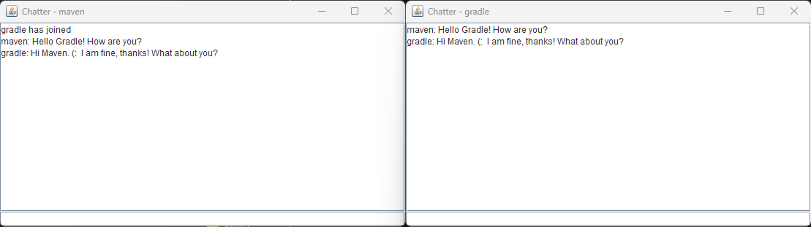
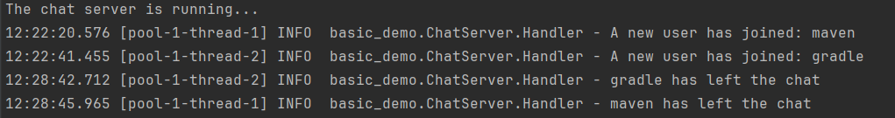
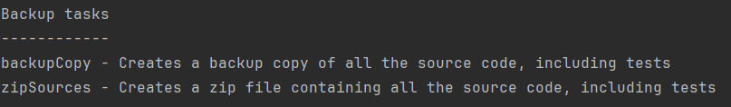

# Class Assignment 2: Build Tools with Gradle - Part 1

## Overview
The goal of this class assignment was to learn how to use Gradle, by using a demo application that implements a basic 
multithreaded chat room server. 
New concepts such as _**task**_, _**plugin**_, _**dependency**_ were explored.
The source code provided to support this assignment is available [**here**](https://bitbucket.org/pssmatos/gradle_basic_demo/src/master/).

**For this assignment two main goals are predicted:**
* Explore the provided demo application;
* Practice gradle, by exploring how to add tasks and dependencies to a Gradle project.

<br>

**Important notes:**
* Main tasks were identified and issues were created in accordance on GitHub. Once the issue was solved,
  it was closed and linked to a specific commit (the web version of GitHub was used);
* The repository containing all the work developed for this assignment can be found [**here**](https://github.com/MarianaPereira7/devops-23-24-JPE-PSM-1231844/tree/main/CA2/Part1).

<br>

Considering this assignment's objectives, the following issues were created (numbers are relatived to this assignment and
only, not considering the autogenerated issue numbers by GitHub):

| Issue Number |                            Description                            |
|:------------:|:-----------------------------------------------------------------:|
|    **#1**    |                Setting up the environment for CA2                 |
|    **#2**    |             Experiment Gradle Basic Demo Application              |
|    **#3**    |               Add a new task to execute the server                |
|    **#4**    |        Add a simple unit test and update the gradle script        |
|    **#5**    | Add a new task to make a backup of the sources of the application |
|    **#6**    |                    Add a new task of type Zip                     |
|    **#7**    |        Add readme file and mark the end of the assignment         |

<br>

---

## Table of Contents

1. [Gradle: What is it?](#1-gradle-what-is-it?)
2. [Part 1: Setting Up the Environment for the Assignment](#part-1-setting-up-the-environment-for-the-class-assignment)
3. [Part 2: Assignment Tasks](#part-2-assignment-tasks)
    - [3.1 Experiment the application](#3-1-experiment-the-application)
    - [3.2 Add a task to execute the server](#3-2-add-a-task-to-execute-the-server)
    - [3.3 Add a unit test and update the gradle script](#3-3-add-a-unit-test-and-update-the-gradle-script)
    - [3.4 Add a new task to make a backup of the sources of the application](#3-4-add-a-new-task-to-make-a-backup-of-the-sources-of-the-application)
    - [3.5 Add a new task of type Zip](#3-5-add-a-new-task-of-type-zip)
5. [Useful Sources](#5-useful-sources)

<br>

---
## 1. Gradle: What is it?
Gradle is a build automation tool, which takes all the code and packages it into a deployable unit that can be run on a
target environment. Some reasons to apply Gradle in projects:  
1. Makes building and running applications very easy;
2. Anyone cloning a project which uses Gradle does not need to install it, since Gradle wrapper comes
bundled with it (project build can be immediately done with a single command `./gradlew build`. It compiles, tests and packages the application);
3. Build script is simpler in comparison to other build tools like Maven, since Gradle uses code to define the build instead 
of XML; 
4. Supports incremental builds, which means that if the code does not change, there is no need to rerun the same tests run before.


**Some key Gradle concepts are:**
1. build.gradle file: is the Gradle build script which describes how the project is built/its configurations;
2. plugin: is the main way to add more functionality to the build;
3. wrapper: script used to invoke Gradle and run tasks;
4. task: defines a unit of work to be executed in the build, which could be anything such as compiling the code. To see a list of all
the available tasks, simply run `./gradlew tasks`. If other tasks are needed, is it possible to create them in accordance with the project needs;
5. repository: is a source were build dependencies are download from;
6. dependency: artifact that is required in order to build the project. Gradle downloads the required dependencies from the
repositories during the build.

<br>

---
## 2. Part 1: Setting Up the Environment for the Assignment
The environment set up for this assignment was done by following the concepts learned in the previous assignment CA1 (please
refer to [this link](https://github.com/MarianaPereira7/devops-23-24-JPE-PSM-1231844/tree/main/CA1) 
`Section 1: Git: How to Get Started` if any further help is needed).   
Briefly, the following steps were considered:
- Create new folders for the assignment in the repository: CA2/Part1;
- Add readme file for Part1;
- Clone given source code from: https://bitbucket.org/pssmatos/gradle_basic_demo/src/master/;
- Remove .git folder.

<br>

---
## 3. Part 2: Assignment Tasks

### 3.1 Experiment the application
In order to experiment the application, first read the instructions provided [here](https://bitbucket.org/pssmatos/gradle_basic_demo/src/master/). 
Open the project in your machine and start by building the application.

1. Navigate to the application folder:
```bash 
cd CA2/Part1/gradle_basic_demo
```

2. Build the project using gradle wrapper, where a .jar file is created:  
**Note:** The project was open having CA2 as the root directory since a different version of Java was needed (vs. CA1 project).
```bash 
./gradlew build
```


3. Experiment the application by first running the server from the project's root directory:
Replace the <server port> for a valid port, e.g. 3333. To stop the server, simply do `Ctrl+C`.
```bash 
java -cp build/libs/basic_demo-0.1.0.jar basic_demo.ChatServerApp <server port>
```

4. Now experiment the client by opening the terminals and running the following command (runClient is
a Gradle task which was already written in the build.gradle file): 
```bash 
./gradlew runClient
```
The above task assumes the chat server's IP is `localhost` and its port is `59001`. If you wish to use other parameters 
please edit the runClient task in the `build.gradle` file.
To run several clients, just open more terminals and repeat the invocation of the runClient gradle task.

The following images show the server running with 2 clients, the clients' interaction and clients leaving the chat room service.

* **Server running and 2 clients join:**


* **Clients interacting:**



* **Clients leave the chat:**



<br>

### 3.2 Add a task to execute the server
To execute the server automatically with a single task instead of indicating the total class path as mentioned before 
`$java -cp build/libs/basic_demo-0.1.0.jar basic_demo.ChatServerApp <server port>`, the following task can be made and
added to the `gradle.build` file:


```groovy
task runServer(type:JavaExec, dependsOn: classes){
    group = "DevOps"
    description = "Starts the chat server on a predefined chosen port on the host machine (port number 59001 is used)"

    classpath = sourceSets.main.runtimeClasspath

    mainClass = 'basic_demo.ChatServerApp'

    args '59001'
}
```

Some considerations regarding the runServer task above:
* The first argument defines the type of task.`JavaExec` is a predefined Gradle task type for executing Java applications;
* The second argument indicates the task dependencies. For the runServer task, `classes` task must be executed first.
The classes task is a built-in task provided by the application plugin (which was already defined in the `build.gradle`
file). It is responsible for compiling the Java source code in a project and producing the compiled class files;
* The task was assigned to the `DevOps` group, along with the runClient task (already declared in the build script);
* The purpose of the task was mentioned by creating a description;
* The classpath field ensures that the compiled classes and their dependencies are available when running the application;
* The mainClass field specifies the main Java class that is to be executed;
* The args fields automatically sets the port number on which the chat server should listen (without a task, port
number has to be passed manually).

Now, by running the command ```./gradlew runServer```, the following output is expected, and it is verified that the 
server is running:


Just to verify, when running the ```./gradlew tasks``` once again, now there are 2 available tasks assigned to the DevOps group:


<br>

### 3.3 Add a unit test and update the gradle script

To create a new test, first create the following directory structure under the `/src` directory and add a new Java Class
called AppTest: `/src/test/java/basic_demo/AppTest.java`.

Then, add the following test to the AppTest Class...:
```java
package basic_demo;
import org.junit.Test;
import static org.junit.Assert.*;
public class AppTest {
   @Test public void testAppHasAGreeting() {
      App classUnderTest = new App();
      assertNotNull("app should have a greeting", classUnderTest.getGreeting());
   }
}
```

...and the visual result is:


It is possible to see that the test does not compile, which means the required dependencies are missing.
In order to run the test, since it is using JUnit, the following update can be done in the `gradle.build` file.  
**NOTE:** The version 4.12 of JUnit is required.
```groovy
dependencies {
   // Use Apache Log4J for logging
   implementation group: 'org.apache.logging.log4j', name: 'log4j-api', version: '2.11.2'
   implementation group: 'org.apache.logging.log4j', name: 'log4j-core', version: '2.11.2'
   // Use JUnit framework for unit testing
   testImplementation 'junit:junit:4.12'
}
```
Only the last line was declared `testImplementation 'junit:junit:4.12'`, since the other two dependencies were already present.
After the update, the project has to be built again, simply run ```./gradlew build.```. In case it is intended to run the
tests automatically, there is a task assigned to the group `Verification tasks` called `test`, which runs the test suite.
Simply execute ```./gradlew test``` and the following outcome is observed:


<br>

### 3.4 Add a new task to make a backup of the sources of the application

In order to make a backup of the source code, it was chosen to copy all the contents of the `/src` directory into a new 
folder under the `build` directory, since is typically used to store all generated files, temporary files, and other artifacts 
produced during the build process. Placing the copied files inside a directory within the build directory keeps them separate 
from the source files and helps organize them within the project structure. Moreover, this way there is to add it to the remote
repository since all content of the build is ignored (build/ is declared in the .gitignore file).

The following task can be added to the build.gradle file:

```groovy
task backupCopy(type:Copy){
   group = "Backup"
   description = "Creates a backup copy of all the source code, including tests"
   from 'src/'
   into 'build/backup'
}
```

Some considerations regarding the runServer task above:
* The unique argument defines the type of task:`Copy`;
* The task was assigned to the `Backup` group. By assigning your task to a specific group, users can easily find and execute it.
* The purpose of the task was mentioned in a description. In this case, the purpose is to create a backup copy of all
the source files (includes tests);
* The content of the entire `/src` folder was selected to be copied;
* The destiny defined was a directory called `backup`.

Now, by running the command ```./gradlew backupCopy```, the task will automatically create the destination directory.
There is no need to create the backup directory manually. This behavior ensures that the build process is robust and 
self-contained, as it automatically handles the creation of necessary directories and ensures that the task can proceed 
without errors.
The differences on the project structure can be seen bellow, where the `/backup` directory is the only difference between the
two images.


| Before running the backupCopy task                                                                     | After running the backupCopy task                                                                    |
|--------------------------------------------------------------------------------------------------------|------------------------------------------------------------------------------------------------------|
|  |  |

<br>

### 3.5 Add a new task of type Zip
In order to make a zip file of the source code, it was chosen to zip all the contents of the `/src` directory and to allocate the
destination file inside the previously created src/backup folder, used for the `backupCopy` task (implemented [**here**](#34-add-a-new-task-to-make-a-backup-of-the-sources-of-the-application)).
For the same reason as stated in the previous task, creating the zip file in the `/src/backup` directory keeps all build
files separated from the actual source code, leading to a cleaner project structure. Again, the zip file was not added to the remote
repository since all content of the build is ignored (build/ is declared in the .gitignore file).

The following task can be added to the build.gradle file:

```groovy
task zipSources(type:Zip){
    group = "Backup"
    description = "Creates a zip file containing all the source code, including tests"
    from 'src/'
    archiveFileName = 'sources_backup.zip'
    destinationDir = file('build/backup')
}
```

Some considerations regarding the runServer task above:
* The unique argument defines the type of task: `Zip`;
* The task was assigned to the `Backup` group, as it was done with the `Copy` task, since they have related purposes.
* The purpose of the task was mentioned in a description. In this case, the purpose is to create a zip file of all
  the source files (includes tests);
* The content of the entire `/src` folder was selected to be compressed;
* The `archiveFileName` property specifies the name of the output zip file, which in this case will be named as `sources_backup.zip`;
* The `destinationDir` property specifies the destination directory where the zip file will be created.

Now, by running the command ```./gradlew zipSources```, the task will automatically create a single zip archive (with the specified 
name of the output file) containing all the expected files or directories. It is important to note that this type of task
does not maintain the original directory structure, but creates a flat structure within the zip file.
There is no need to create the zip file manually. This behavior ensures that the build process is robust and
self-contained, as it automatically handles the creation of necessary directories and ensures that the task can proceed
without errors. It is extremely useful and important for distribution or deployment purposes.

The differences on the project structure can be seen bellow, where the `sources_backup.zip` file inside the `/scr/backup` 
directory is the only difference between the two images.


| Before running the zipSources task                                                                   | After running the zipSources task                                                                  |
|------------------------------------------------------------------------------------------------------|----------------------------------------------------------------------------------------------------|
|  |  |

To verify that both `backupCopy` and `zipSources` tasks and corresponding descriptions were assigned to the `Backup` Group,
the following command can be simply run `./gradlew tasks`. Searching for the `Backup tasks` field, it is verified that 
the two tasks are displayed.



<br>

---
## 5. Useful Sources
* [The Java Plugin](https://docs.gradle.org/current/userguide/java_plugin.html)
* [Using Gradle Tasks](https://docs.gradle.org/current/userguide/tutorial_using_tasks.html)
* [Dependency Management](https://docs.gradle.org/current/userguide/core_dependency_management.html)
* [Gradle Tutorial for Complete Beginners](https://tomgregory.com/gradle/gradle-tutorial-for-complete-beginners/)
* [Building Java Project with Gradle](https://spring.io/guides/gs/gradle)
* [The Gradle build system](https://www.vogella.com/tutorials/GradleTutorial/article.html)
---

