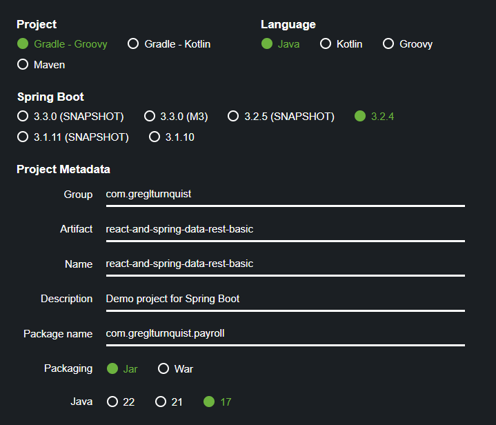
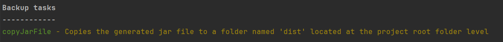
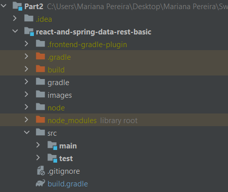
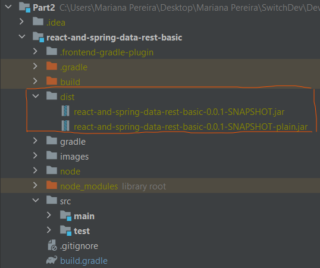
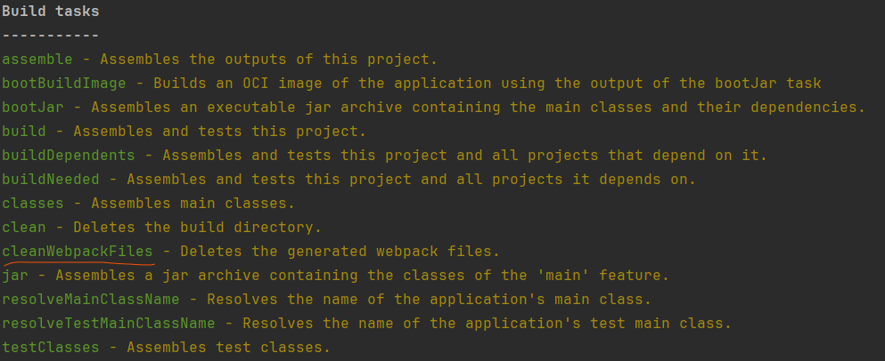
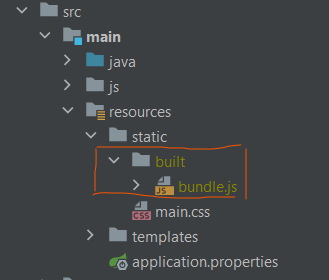
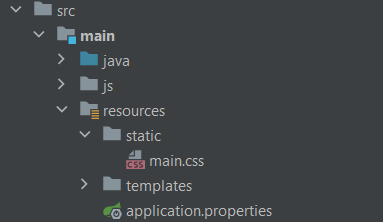

# Class Assignment 2: Build Tools with Gradle - Part 1

## Overview
The goal of this class assignment was to keep learning how to use Gradle, by reusing the final source code of the first
Class Assignment, which is available [**here**](https://github.com/MarianaPereira7/devops-23-24-JPE-PSM-1231844/tree/main/CA1).
It was proposed to use **spring initializr**, which is a web-based tool provided by the Spring team for quickly generating the 
initial structure of a Spring Boot project. Then more tasks were created to was used in order to 

**For this assignment three main goals are predicted:**
* Convert the provided application to Gradle, instead of Maven;
* Create a new branch to fulfil the assignment;
* Continue to explore/practice gradle, by adding more tasks and relevant plugins;
* Explore an alternative build tool apart from Gradle.

<br>

**Important notes:**
* Main tasks were identified and issues were created in accordance on GitHub. Once the issue was solved,
  it was closed and linked to a specific commit (the web version of GitHub was used);
* The repository containing all the work developed for this assignment can be found [**here**](https://github.com/MarianaPereira7/devops-23-24-JPE-PSM-1231844/tree/main/CA2/Part2).

<br>

Considering this assignment's objectives, the following issues were created (numbers are relative to this assignment and
only, not considering the autogenerated issue numbers by GitHub):

| Issue Number |                           Description                            |
|:------------:|:----------------------------------------------------------------:|
|    **#1**    |       Create a new branch to develop the class assignment        |
|    **#2**    | Create a task to copy the generated jar file to a defined folder |
|    **#3**    |    Create a task to delete all the files generated by webpack    |
|    **#4**    |                 Explore an alternative solution                  |
|    **#5**    |        Add readme file and mark the end of the assignment        |

<br>

---

## Table of Contents

1. [Part 1: Setting Up the Environment for the Assignment](#part-1-setting-up-the-environment-for-the-assignment)
    - [1.1 Create a new branch](#11-create-a-new-branch)
    - [1.2 Use spring initializr tool](#12-use-spring-initializr-tool)
    - [1.3 Arrange the project files](#13-arrange-the-project-files)
    - [1.4 Add the frontend plugin and its configuration](#14-add-the-frontend-plugin-and-its-configuration)
2. [Part 2: Assignment Tasks](#part-2-assignment-tasks)
    - [2.1 Add a task to copy the generated jar file](#21-add-a-task-to-copy-the-generated-jar-file)
    - [2.2 Add a task to delete all the files generated by webpack](#22-add-a-task-to-delete-all-the-files-generated-by-webpack)
    - [2.3 Merge tut-basic-gradle branch with main](#23-merge-tut-basic-gradle-branch-with-main)
3. [Part 3: An Alternative Solution](#part-3-maven-an-alternative-solution)
4. [Useful Sources](#4-useful-sources)

<br>

---
## Part 1: Setting Up the Environment for the Assignment

### 1.1 Create a new branch
This assignment is supposed to be developed in a separate branch called `tut-basic-gradle`. Open git bash on repository and
run the following set of commands, in order to in order to create a new branch called tut-basic-gradle in your local repository, 
switch your working directory to the new branch to start working on it and, finally, push it to the remote repository to 
start tracking the new local branch.

```bash
$ git branch tut-basic-gradle
$ git checkout tut-basic-gradle
$ git push -u origin tut-basic-gradle
```

### 1.2 Use spring initializr tool
To start the new project, it was required to use the spring initializr tool in order to quickly generate the initial structure of 
the Spring Boot project. By doing so, it will generate the necessary dependencies, configuration, and directory structure.
Use this link and fill the required fields as it is displayed in the image below:



Then, in the `ADD DEPENDENCIES` field, select add Rest Repositories, Thymeleaf, JPA and H2 as dependencies ofr the current project.
Below there is a brief explanation of each one:
* **Rest Repositories:**  
Also known as Spring Data REST repositories, are a feature of the Spring Data project that automatically expose JPA 
repositories as RESTful endpoints. They enable CRUD (Create, Read, Update, Delete) operations over HTTP using standard 
RESTful conventions, allowing easy access to data without writing explicit controller code.

* **Thymeleaf:**  
Thymeleaf is a Java-based templating engine commonly used in web development. It allows developers to create dynamic and 
interactive web pages by seamlessly integrating server-side logic with HTML templates. Thymeleaf templates can be processed 
both on the server side and in the client's browser, making it versatile for various web application architectures.

* **JPA:**  
Java Persistence API, is a Java specification for accessing, persisting, and managing data between Java objects 
and relational databases. With JPA, developers can define entity classes to represent database tables, annotate them to map 
to database columns, and use EntityManager to perform CRUD operations.

* **H2:**  
An open-source relational database management system written in Java. It's known for its fast performance, 
small footprint, and easy setup, making it popular for development, testing, and prototyping purposes. 
H2 supports SQL queries and provides features like transactions, indexes, and stored procedures.


Finally, click on `GENERATE`, where a zip file will be generated. Extract the contents to an empty folder on your repository.
A spring application can now be built using gradle. If you wish to see the available gradle tasks, you
can do so by executing the `./gradlew tasks` command.

### 1.3 Arrange the project files
As mentioned before, this assignment uses the source code of the first class assignment present in the current repository.
Start by deleting the `/src` folder and  all of its contents and then go to this [link](https://github.com/MarianaPereira7/devops-23-24-JPE-PSM-1231844/tree/main/CA1/tut-react-and-spring-data-rest/basic)
to manage the required files:
* copy the proper source code (`/src` folder);
* copy `webpack.config.js` and `package.json` files;
* delete the folder `src/main/resources/static/built/`.

Some compilation errors might occur in the `Employee.java` file, but you can easily resolve it by changing the class imports to the following:
```java
import javax.persistence.Entity;
import javax.persistence.GeneratedValue;
import javax.persistence.Id;
```

### 1.4 Add the frontend plugin and its configuration
At the moment, when running the application and launching the browser, the web page shows no results (is empty). There is the
need to add a plugin to deal with the frontend code. There are several plugins used to handle frontend-related tasks within Gradle builds, 
but the chosen one was the `org.siouan.frontend` plugin. To properly add this plugin to, open the build.gradle file and add 
it to the plugins block. Since version 17 of Java was used for the current project, the following line was added to the projects configuration file:
```groovy
id "org.siouan.frontend-jdk17" version "8.0.0"
```

Finally, for the plugin to fulfil its purpose for the current project, add the following configuration to the build.gradle file:
```groovy
frontend {
    nodeVersion = "16.20.2"
    assembleScript = "run build"
    cleanScript = "run clean"
    checkScript = "run check"
}
```

And also add the following information to the `package.json` file to properly configure the execution of the webpack:
```
"packageManager": "npm@9.6.7",
  "scripts": {
    "webpack": "webpack",
    "build": "npm run webpack",
    "check": "echo Checking frontend",
    "clean": "echo Cleaning frontend",
    "lint": "echo Linting frontend",
    "test": "echo Testing frontend"
  }
```
Some relevant information:
* The package.json file is used in Node.js projects to manage project dependencies, scripts and metadata;
* The `packageManager` entry specifies the version of the package manager to be used for installing dependencies. In this case, 
"npm@9.6.7", indicates that npm version 9.6.7 should be used. This version specification ensures consistency across different 
npm installations and environments.


---
## Part 2: Assignment Tasks

### 2.1 Add a task to copy the generated jar file
To copy the generated jar file which results from the building process and is located at `build/libs` directory, the following
task can be added to the build.gradel script file:

```groovy
task copyJarFile(type:Copy, dependsOn:bootJar){
	group = "Backup"
	description = "Copies the generated jar file to a folder named 'dist' located at the project root folder level."
	from 'build/libs'
	into 'dist'
	include '*.jar'
}
```
In this task, the intended jar files are copied to a new folder called `dist` located at the project root level.
Running `./gradlew tasks` command again, it is possible to verify that the new task was assigned to the `Backup tasks` group.

  
  
Now, if running `./gradlew copyJarFile`, the tasks works as expected.

|                      Before running the copyJarFile task                       |                      After running the copyJarFile task                       |
|:------------------------------------------------------------------------------:|:-----------------------------------------------------------------------------:|
|  |  |

<br>

### 2.2 Add a task to delete all the files generated by webpack
Webpack is typically used in front-end web development projects to bundle and manage JavaScript, CSS, and other 
static assets. The process of generating webpack files usually occurs during the project's build phase, specifically during 
the packaging phase or as part of a custom build script. The generated files are usually located at `src/main/resources/static/built/`,
so, in order to delete this content, the task below was written in the `build.gradle` script file:

```groovy
task cleanWebpackFiles(type:Delete){
   group = "Build"
   description = "Deletes the generated webpack files."
   delete 'src/main/resources/static/built/'
}
```

Running `./gradlew tasks` command again, it is possible to verify that the new task was assigned to the `Build tasks` group.

  
  

Now, if running `./gradlew cleanWebpackFiles`, the tasks works as expected.

|                 Before running the cleanWebpackFiles task                 |                After running the cleanWebpackFiles task                 |
|:-------------------------------------------------------------------------:|:-----------------------------------------------------------------------:|
|  |  |


<br>

### 2.3 Merge tut-basic-gradle branch with main
Now that everything is working, is time to apply all the changes in the main branch.
To reflect this changes in the main branch, switch to the main branch, merge changes from the `tut-basic-gradle` branch into `main` 
with a non-fast-forward merge, and then push the changes to the remote repository.
Note: A non-fast-forward merge preserves the history and clearly indicates that a merge has occurred, even if there are no 
divergent changes between the branches.

```bash
$ git checkout main
$ git merge --no-ff tut-basic-gradle
$ git push origin main
```


---
## 4. Useful Sources
* [The Java Plugin](https://docs.gradle.org/current/userguide/java_plugin.html)
* [The Frontend Plugin](https://plugins.gradle.org/plugin/org.siouan.frontend-jdk17)
* [Task Execution](https://docs.gradle.org/current/userguide/controlling_task_execution.html)
* [Building Java Project with Gradle](https://spring.io/guides/gs/gradle)
* [Building Java Project with Maven](https://spring.io/guides/gs/maven)
---

