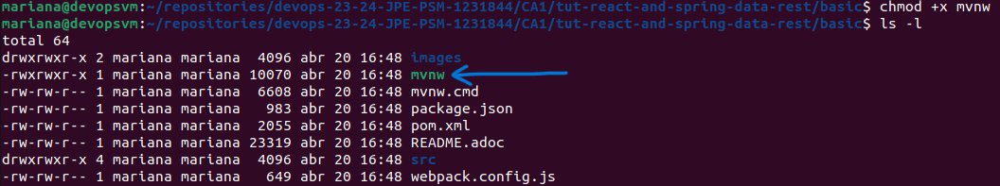
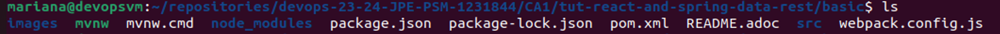
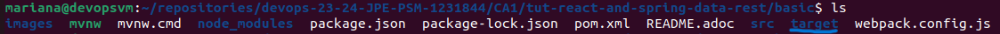

# Class Assignment 3: Virtualization with Vagrant - Part 1

## Overview
The goal of this class assignment was to learn about Virtualization, recurring to VirtualBox. A Virtual Machine (VM) was 
created and the main objective was to build and execute the projects developed during the previous class assignments, but
using that VM.
The source code is available [**here**](https://github.com/MarianaPereira7/devops-23-24-JPE-PSM-1231844/).

**For this assignment three main goals are predicted:**
* Create a Virtual Machine (VM) using VirtualBox as hypervisor;
* Build and execute the spring boot tutorial basic project in the VM;
* Build and execute the gradle basic demo project in the VM.

**Important notes:**
* Main tasks were identified and issues were created in accordance on GitHub. Once the issue was solved,
  it was closed and linked to a specific commit (the web version of GitHub was used);
* The repository containing the report written for this assignment and the auxiliary generated documentation can be found 
[**here**](https://github.com/MarianaPereira7/devops-23-24-JPE-PSM-1231844/tree/main/CA3/Part1).

<br>

Considering this assignment's objectives, the following issues were created (numbers are relative to this assignment and
only, not considering the autogenerated issue numbers by GitHub):

| Issue Number |                       Description                        |
|:------------:|:--------------------------------------------------------:|
|    **#1**    | Create and configure a Virtual Machine using VirtualBox  |
|    **#2**    | Build and execute the spring boot tutorial basic project |
|    **#3**    |     Build and execute the gradle basic demo project      |
|    **#4**    |    Add readme file and mark the end of the assignment    |

<br>

---

## Table of Contents

1. [Part 1: Create and Configure a Virtual Machine Using VirtualBox](#part-1-create-and-configure-a-virtual-machine-using-virtualbox)
    - [1.1 Create a Virtual Machine](#11-create-a-virtual-machine)
    - [1.2 Configure the Virtual Machine network adapters](#12-configure-the-virtual-machine-network-adapters)
2. [Part 2: Build and Execute Projects in a Virtual Machine](#part-2-build-and-execute-projects-in-a-virtual-machine)
    - [2.1 Spring boot tutorial basic project](#21-spring-boot-tutorial-basic-project)
    - [2.2 Gradle basic demo project](#22-gradle-basic-demo-project)
3. [Useful Sources](#3-useful-sources)

---

## Part 1: Create and Configure a Virtual Machine Using VirtualBox

Virtualization is the process of creating a virtual version of a computing resource, such as a server, storage device, 
or network. It allows multiple virtual environments to run on a single physical machine, maximizing resource utilization 
and flexibility. Virtualization is useful for consolidating servers, testing software in isolated environments, and running 
multiple operating systems on a single computer.  

VirtualBox is an open-source virtualization software, which runs in many host operating systems, such
as Windows, Linux and OSX. VirtualBox is a hypervisor, also known as a virtual machine monitor or VMM, is software that 
enables users to create and manage virtual machines on their desktop or laptop computers. A hypervisor allows one host 
computer to support multiple guest VMs by virtually sharing its resources, such as memory and processing. This means that 
it is possible to install and run as many virtual machines as you like, the only practical limits are disk space and memory.

It is assumed that you already have VirtualBox installed in your machine. In order to install it, just follow this 
[**link**](https://www.virtualbox.org/wiki/Downloads).

### 1.1 Create a Virtual Machine

Let's start by creating a virtual machine. Follow the steps below:
- Download the ISO image you would like to use (follow this [**link**](https://help.ubuntu.com/community/Installation/MinimalCD)).
The image used for the purpose of this assignment was Ubuntu-22.04 desktop version.  
**Note:** An ISO image for virtual machines is essentially a file containing a complete copy of a CD or DVD disc, including the 
file system itself. It's commonly used to install operating systems or software onto virtual machines. Virtualization software, 
like VirtualBox, can mount an ISO image as if it were a physical disc inserted into a virtual CD/DVD drive, allowing you to 
install software or operating systems directly onto the virtual machine without needing an actual physical disc.  


- Launch VirtualBox and create a new machine, give it a name and select the downloaded ISO file;


- On VirtualBox GUI click on your VM to start it and follow the steps to install Ubuntu (this process will take several minutes).

<br>

### 1.2 Configure the Virtual Machine network adapters

After installation and before starting your VM again, configure your network adapters.  
First create your host-only-network. Go to `Tools -> Create` and a new Host-only Network should be generated. You can
  then configure it, by defining your host IP address to communicate with the VMs and then configure the VM network adapters.
  Click on your VM, then `Settings -> Network` and:
* Set Network Adapter 1 as NAT mode;  
  NAT stands for Network Address Translation and is commonly used when we want our virtual machines to have 
  internet access but don't need them to be directly reachable from the external network. It provides a convenient way 
  to share the host computer's network connection with the virtual machines while providing a level of isolation and security.

* Set the Network Adapter 2 as Host-only Adapter.
  A Host-Only network setup, the virtual machines (VMs) can communicate with each other and with the host machine, but 
they cannot access resources outside of this closed network, such as the internet or other external networks.
   

Verify the range of your host-only-network and choose an IP for your VM, to further set your second adapter.
In this case, the host-only network has de below configuration, meaning that an available range of IPs is available from
`192.168.101.2-254` (excluding the possibility that any IP could already be in use by other devices).  
The IP `192.168.101.0` is used to define the network.  
The IP `192.168.101.1` is allocated to the host network adapter.  
The IP `192.168.101.255` is typically used as the broadcast address in a subnet with the IP range 192.168.101.0/24. 
In networking, the broadcast address is a special address that allows communication to all devices within the same subnet.


In order to configure your Adapter 2 in your VM, start it and run the following commands:
1. Update the packages repositories: 
```bash 
$ sudo apt update
```

2. To install the network tools:
```bash 
$ sudo apt install net-tools
```

3. To edit the network configuration file and set the IP for the second adapter. In this case, the second adapter IP
was set to `192.168.101.7` as shown below. Do not forget to save the changes made to the file.
```bash 
$ sudo nano /etc/netplan/01-netcfg.yaml
```

```
network:
  version: 2
  renderer: NetworkManager
  ethernets:
    enp0s3:
      dhcp4: yes
    enp0s8:
      addresses:
        - 192.168.101.7/24
```

4. To apply the changes made:
```bash 
$ sudo netplan apply
```

5. Verify that now there are 3 network adapters by running `ifconfig` command on the VM terminal.


Each adapter has the following purposes:
* **enp0s3:** is associated with the NAT mode configured above, has the IP address `10.0.2.15` with a subnet mask of
`255.255.255.0` and is used for internet access in the VM;

* **enp0s8:** is associated with the Host-Only mode configured above, has the IP address `192.168.101.7` with a subnet mask of
  `255.255.255.0` and is used for communication between the host machine and the virtual machine or, eventually, between multiple
virtual machines;

* **lo:** is the loopback interface, it has the IP address `127.0.0.1`, commonly known as the loopback address, 
which is used for local communication, such as accessing services running on the same machine.

<br>

## Part 2: Build and Execute Projects in a Virtual Machine

To continue the assignment, since it is required to clone a repository from GitHub and execute java applications, 
a proper version of git and JDK installed must be installed in the VM. To do so, run the following commands, separately:

```bash
$ sudo apt install git
$ sudo apt install openjdk-8-jdk-headless
```

---------------------------------------------------------------------

**Note:** Why _headless_?

In the context of the command sudo apt install openjdk-8-jdk-headless, _headless_ refers to a version of the Java 
Development Kit (JDK) that does not include graphical user interface (GUI) components or libraries.  
In Java development, the JDK typically includes tools and libraries for developing both GUI (Graphical User Interface) 
applications and non-GUI applications. The _headless_ version of the JDK is designed for use in environments where there 
is no need for GUI components, such as servers or headless systems (systems without a graphical interface).

By installing the _headless_ version of the JDK, the core Java development tools and libraries necessary for 
compiling, running, and debugging Java applications, are guaranteed, but without the overhead of GUI-related components. 
This can be useful in server environments or when developing applications that run on systems without a graphical interface.

---------------------------------------------------------------------

Furthermore, it would be also interesting and advantageous to install the ssh server on your VM in order to enable future 
ssh connections from the host machine. An SSH server allows users to remotely access and control a computer or server over a 
network. Users can log in to the remote machine using SSH client software and execute commands, transfer files, 
or perform other tasks.

Follow the instructions below:
* Install openssh-server to use ssh to open secure terminal sessions to the VM:
$ sudo apt install openssh-server


* Enable password authentication for ssh and uncomment the line `PasswordAuthentication yes`:
$ sudo nano /etc/ssh/sshd_config
$ sudo service ssh restart


It was decided to clone the repository using SSH, so it was required to generate the private-public key pair to establish 
the connection with the SSH server, using the command below. The public key is shared with the host, and the private key 
is kept confidential for security in your virtual machine.

```bash
$ ssh-keygen -t rsa
```

If a file name is not specified, the default file names for each key are the following:
* **private key:** id_rsa
* **public key:** id_rsa.pub
  These files will be stored in the `.ssh` directory in your VM home directory (~/.ssh).

Since ssh server was already enabled before, it is possible to access to the id_rsa.pub file, generated in the virtual machine, from the host machine.
Try it out by opening a terminal in your host and type your VM username followed by its IP (attributed when configuring your Host-only network in the step XXXX). As an example, for this assignment it was used:
$ ssh mariana@192.168.101.7

Print the public key in your terminal and then copy it:

```bash
$ cat .ssh/id_rsa.pub
```

Now, go to your GitHub account and add a new SSH key to enable future authentications from your VM. Follow the steps below:
* In the top right corner, click in your account icon and select `Settings`;
* In the sidebar options, click on `SSH and GPG keys`;
* Click on `New SSH key`;
* Give it a name on the `Title` field to be easier for you to manage it (in case you have several keys);
* Paste the key (copied in the previous step) in the `Key` field and hit `Add SSH key`.

Although not mandatory, to establish a connection to GitHub, in order not to have to constantly type your username and password, 
execute the following set of commands, where `your username` should be your GitHub username and `your password` should be replaced 
by your GitHub account password.
```bash
$ git config --global credential.helper cache
$ git config --global user.name 'your username'
$ git config --global user.password 'your password'
```

It is finally time to clone the repository from GitHub. The command bellow is using SSH since our GitHub account
we just configured to accept authentications from our VM (the operation could also be performed by using HTTPS).
**NOTE 1:** For this class assignment, the cloned repository is private.
**NOTE 2:** before executing the cloning command, navigate to the folder where you intended to allocate the repository 
using the `cd` command. For this project, a folder called `repositories` was created, which will be seen in future 
screenshots and commands.

```bash
$ git clone git@github.com:MarianaPereira7/devops-23-24-JPE-PSM-1231844.git
```

Using this SSH URL with the `git clone` command, Git will use your SSH key pair for authentication and clone the 
repository from the specified location on the Git server.

Before trying out the applications, it is not mandatory, but you can also install both maven and gradle by running the 
commands bellow:

```bash
$ sudo apt install maven
$ sudo apt install gradle
```

<br>

### 2.1 Spring boot tutorial basic project

1. Navigate to the first project in order to test it:
```bash
$ cd devops-23-24-JPE-PSM-1231844/CA1/tut-react-and-spring-data-rest/basic/
```

<br>

2. Now try to install the project `./mvnw clean install`
You will conclude it is not possible, due to the `mvnw` file permissions, run `ls -l`:


<br>

3. To add execution permissions, run the command: `chmod +x mvnw` and run `ls -l` again to confirm `mvnw` file permissions 
have changed:



<br>

4. Build the project by running again `./mvnw clean install`:

* **Before Build** - No /target folder:



<br>

* **After Build** - It can be seen that the build phase has happened since the `/target` folder was created:



<br>

5. Run the application with `./mvnw spring-boot:run` and test it by opening your browser in your host machine and type the 
following URL: http://192.168.101.7:8080, where `192.168.101.7` is the IP address of the server (which should be replaced 
by your VM IP address) and 8080 is the port 
in the server where the application is running.


<br>

### 2.2 Gradle basic demo project

1. Navigate to the second project in order to test it:
```bash
$ cd ~/repositories/devops-23-24-JPE-PSM-1231844/CA2/Part1/gradle_basic_demo/
```

2. Try to build the project by running `./gradlew build`. You will encounter the same problem as seen in the previous project.
Execution permissions are required. Execute `chmod +x gradlew` command and then try to build the project again.


3. You can check the tasks created during the assignment are present with the `gradlew tasks` command:


<br>

4. Run the runServer task in your VM's terminal: `./gradlew runServer`, then, as requested, open a terminal in your host machine, build 
the project and run the task runClient: `./gradlew runClient`... 

    ... but it is not possible to launch the room chat service.

To recall, in the CA2 assignment, the runClient task was already given and defined as:

```groovy
task runClient(type:JavaExec, dependsOn: classes){
    group = "DevOps"
    description = "Launches a chat client that connects to a server on localhost:59001 "

    classpath = sourceSets.main.runtimeClasspath

    mainClass = 'basic_demo.ChatClientApp'

    args 'localhost', '59001'
}
```

This task is built in a way that the server IP and Port are not passed as command line arguments, but instead, they are both fixed.
At the time of CA2, it was supposed to run the server and the client in the same machine, so no problems were identified.
Now, it is required to run the server in the virtual machine and the client in the host machine. Since server IP is 
defined to be the localhost and the application is being run at the host machine, there will never be a connection to the server.

To succeed in connecting to the server and launch the chat room service, the runClient task should be changed to:

```groovy
task runClient(type:JavaExec, dependsOn: classes){
    group = "DevOps"
    description = "Launches a chat client that connects to a server on localhost:59001 "
    
    classpath = sourceSets.main.runtimeClasspath
    
    mainClass = 'basic_demo.ChatClientApp'

    if (project.hasProperty('serverIp')) {
        args project.serverIp, '59001'
    } else {
        args 'localhost', '59001'
    }
}
```

where the if statement allows to specify the IP where the server is running (if omitted, it assumes `localhost` is to be considered).
With this modification, the runClient task can be run with an additional parameter `-PserverIp=<IP_ADDRESS>` to specify the 
IP address where the server is running (the port definitions were maintained). The `-P` flag is used to pass project properties 
from the command line. When using `-PserverIp=<IP_ADDRESS>`, a project property named `serverIp` is set with the value `<IP_ADDRESS>`. 
This property can then be accessed within the Gradle build script.

Build your project again and try to execute the runClient task one more time to launch the chat room service, but now specify 
the actual server IP address as follows:
```bash
$ ./gradlew runClient -PserverIp=192.168.101.7
```

**NOTE:** `192.168.101.7` is the IP address of the VM in use to fulfill these class assignment objectives, replace it in 
accordance to your corresponding VM IP address.

Below you have a visual representation of what to expect when running this commands.

* **Starting the Server** - Virtual Machine Side:


<br>

* **Running the Client and Launching the chat room** - Host Side:


<br>

* **Clients joining and leaving** - Virtual Machine Side:


<br>


---
## 3. Useful Sources
* [Why is Virtualization Useful](https://www.virtualbox.org/manual/ch01.html#virt-why-useful)
* [What is an hypervisor and their benefits](https://www.vmware.com/topics/glossary/content/hypervisor.html)
* [Virtual Networking](https://www.virtualbox.org/manual/UserManual.html#networkingdetails)

---
