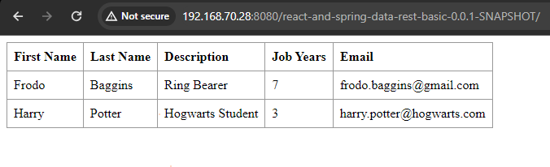
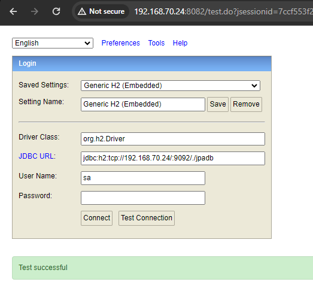
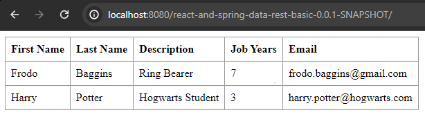
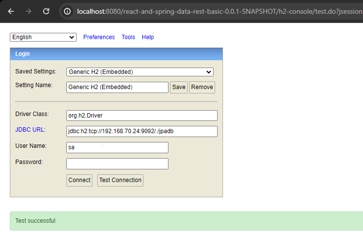
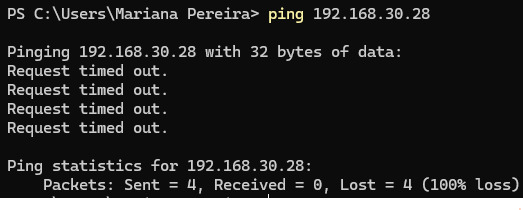
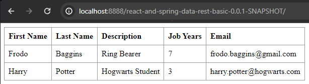
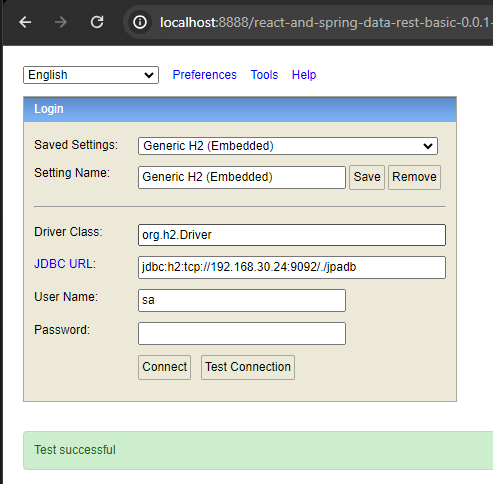

# Class Assignment 3: Virtualization with Vagrant - Part 2

## Overview
The goal of this class assignment was to deepen the knowledge in regard to Virtualization, recurring to Vagrant and VirtualBox.
Vagrant was used to set up a virtual environment and VirtualBox as the virtualization provider.
The source code of this assignment is available [**here**](https://github.com/MarianaPereira7/devops-23-24-JPE-PSM-1231844/).
The auxiliary code to update the application files can be consulted [**here**](https://bitbucket.org/pssmatos/tut-basic-gradle/src/master/)
and the example Vagrantfile can be analyzed [**here**](https://bitbucket.org/pssmatos/vagrant-multi-spring-tut-demo/src/master/).

**For this assignment three main goals are predicted:**
* Configure a Vagrantfile to set up two virtual machines (VMs), using VirtualBox as the virtualization provider, where one
VM should be used to run tomcat (web server) and the spring boot basic application, and the second VM should be used to
run an H2 server database.
* Do the same as above, but choosing an alternative virtualization provider. For this assignment, VMware was chosen.

**Important notes:**
* Main tasks were identified and issues were created in accordance on GitHub. Once the issue was solved,
  it was closed and linked to a specific commit (the web version of GitHub was used);
* The repository containing the report written for this assignment and the auxiliary generated documentation can be found
  [**here**](https://github.com/MarianaPereira7/devops-23-24-JPE-PSM-1231844/tree/main/CA3).

<br>

Considering this assignment's objectives, the following issues were created (numbers are relative to this assignment and
only, not considering the autogenerated issue numbers by GitHub):

| Issue Number |                                      Description                                      |
|:------------:|:-------------------------------------------------------------------------------------:|
|    **#1**    |                    Set up the environment for the Class Assignment                    |
|    **#2**    | Update the given Vagrantfile configuration to use the solution developed in CA2 Part2 |
|    **#3**    |                    Implement an alternative solution to VirtualBox                    |
|    **#4**    |                  Add readme file and mark the end of the assignment                   |

<br>

---

## Table of Contents

1. [Part 1: Set Up the Environment](#part-1-set-up-the-environment)
2. [Part 2: Use Vagrant to Set Up a Virtual Environment](#part-2-use-vagrant-to-set-up-a-virtual-environment)
    - [2.1 VirtualBox as the virtualization provider](#21-virtualbox-as-the-virtualization-provider)
    - [2.2 VirtualBox vs. VMware](#22-virtualbox-vs-vmware)
    - [2.3 VMware as the virtualization provider](#23-vmware-as-the-virtualization-provider)
3. [Useful Sources](#3-useful-sources)

---

## Part 1: Set Up the Environment

In order to be possible to deploy the application in a web server running on a VM and the H2 server running on another,
the following files had to be updated/created. Below there is a concise explanation of the changes:  
<br>
  
**1.** Update `configuration.properties` file located in `src/main/resources` for Vagrant to be able to launch the H2
 server in a VM according to the following:
* Set the base for all web endpoints of the application and then for all REST endpoints of the application.
```groovy
server.servlet.context-path=/react-and-spring-data-rest-basic-0.0.1-SNAPSHOT/
spring.data.rest.base-path=/api
```

* Datasource configuration, where the IP address and the corresponding port where the H2 server is running in is dynamically
attributed through the creation of environment variables (more on that later in [section 2](#part-2-use-vagrant-to-set-up-a-virtual-environment)).

```groovy
spring.datasource.url=jdbc:h2:tcp://${DATABASE_IP}:${DATABASE_PORT}/./jpadb;DB_CLOSE_DELAY=-1;DB_CLOSE_ON_EXIT=FALSE
spring.datasource.driverClassName=org.h2.Driver
spring.datasource.username=sa
spring.datasource.password=
spring.jpa.database-platform=org.hibernate.dialect.H2Dialect
```

* Enable the H2 web console, which is a web-based interface to interact with the H2 database;
* Set the path where H2 console is accessible, which should be `/react-and-spring-data-rest-basic-0.0.1-SNAPSHOT//h2-console`;
* Allows access to the console from other machines (host for instance).

```groovy
spring.jpa.hibernate.ddl-auto=update
spring.h2.console.enabled=true
spring.h2.console.path=/h2-console/
spring.h2.console.settings.web-allow-others=true
```
<br>

**2.** Update `app.js` file located on `src/main/js` to consider the new application endpoint:
```javascript
componentDidMount() {
    client({method: 'GET', path: '/react-and-spring-data-rest-basic-0.0.1-SNAPSHOT/api/employees'}).done(response => {
            this.setState({employees: response.entity._embedded.employees});
		});
}
```
<br>
  
**3.** Add `war plugin` and `tomcat dependency` to `build.gradle` file, which is located at the root of the project.
This way, with the war plugin, running `./gradlew build` will generate a `war file` in the `build/libs` directory,
ready to be deployed by a servlet container.  
* **Servlet container:** a server that manages and executes Java servlets, handling web requests and responses. In this case, 
**Apache Tomcat** server was used.  
* **Jar vs. War files:** A `war` file is for web applications, deployable to servlet containers, while a `jar` file is for 
general Java applications, runnable or used as a library.

<br>

**4.** Customize the `bootRun` task using the systemProperties method to override the `spring.datasource.url property`
defined in the `application.properties` file. This way, CA2 Part2 can still be run as originally, having an H2 embedded database.
```groovy
tasks.named('bootRun') {
	systemProperty 'spring.datasource.url', 'jdbc:h2:mem:jpadb'
}
```
<br>

**5.** Create a `ServletInitializer` class to bootstrap the Spring Boot application in an external servlet container. Locate it
in the same directory as the src code classes.
This is required, since the objective is to deploy the Spring Boot application as a traditional war file to a 
servlet container (like Apache Tomcat) instead of running it as a standalone jar with an embedded server. 
This class provides the configuration required for the application to start correctly within the servlet container.

```java
import org.springframework.boot.builder.SpringApplicationBuilder;
import org.springframework.boot.web.servlet.support.SpringBootServletInitializer;

public class ServletInitializer extends SpringBootServletInitializer {

    @Override
    protected SpringApplicationBuilder configure(SpringApplicationBuilder application) {
        return application.sources(ReactAndSpringDataRestApplication.class);
    }

}
```
<br>

**6.** Update the `index.html` file located on `src/main/resources/templates`.

<br>

## Part 2: Use Vagrant to Set Up a Virtual Environment
Now that the environment was set, let's dive into the configuration of the virtual machines.
VirtualBox was already introduced before (please refer to [**this**](https://github.com/MarianaPereira7/devops-23-24-JPE-PSM-1231844/tree/main/CA3/Part1) project for more information).
Vagrant is a new concept, and basically is a tool that allows to easily create, configure, and manage reproducible development 
environments using virtual machines or containers. 
  
**Some relevant notes:**
* In simple words, vagrant helps us automate the setup of one or more VMs. This configuration in done via a single file known as `Vagrantfile`.
  
* Vagrant runs in several operating systems and supports different providers/hypervisors.
  
* By simply sharing a Vagrantfile, one can easily reproduce the same environment.
  
* Simple commands can be found [**here**](https://gist.github.com/wpscholar/a49594e2e2b918f4d0c4) in order to get started and several boxes are available [**here**](https://app.vagrantup.com/boxes/search). Just be sure to verify
that it is compatible with the hypervisor you intend to use.

<br>

### 2.1 VirtualBox as the virtualization provider

For this assignment, as previously mentioned, the Vagrantfile used was updated from a similar project.
However, some changes were needed, mainly for the web VM and are listed and simply explained below:  
<br>

**1.** The ports in use were maintained but the IP addresses of the VMs were changed. Make sure the chosen IPs are in the same
network. For instance, `192.168.70.24` was set to the database server and `192.168.70.28` to the web server.
This was done to verify the behaviour of VirtualBox hypervisor (more on this later).  
<br>

**2.** Provision the web VM to set environment variables `DATABASE_IP` and `DATABASE_PORT` by appending their values to a 
file named `env_vars.sh` located in the `/etc/profile.d` directory.  
**These variables are automatically created once a shell session is opened, because the values are stored in a shell script 
file in that specific directory.** This configuration will allow the web server to communicate with the database server.
```ruby
web.vm.provision "shell", inline: <<-SHELL
      echo -n                                   >  /etc/profile.d/env_vars.sh
      echo 'export DATABASE_IP=192.168.30.24'   >> /etc/profile.d/env_vars.sh
      echo 'export DATABASE_PORT=9092'          >> /etc/profile.d/env_vars.sh
    SHELL
```
<br>

**3.** A newer version of the Tomcat server had to be installed (attention: by the type you use this version, it may not be available anymore,
please update it accordingly).
```ruby
web.vm.provision "shell", inline: <<-SHELL

      wget https://dlcdn.apache.org/tomcat/tomcat-10/v10.1.24/bin/apache-tomcat-10.1.24.tar.gz

      sudo tar xzvf apache-tomcat-10*tar.gz -C .

      sudo chown -R vagrant:vagrant apache-tomcat-10*

      sudo chmod -R u+x apache-tomcat-10*

    SHELL
```
<br>

**4.** Add a shell provision script to start the Apache Tomcat server, ensuring that the script is executed every time the provisioner 
runs, regardless of whether changes have been made to the VM.
```ruby
web.vm.provision "shell", :run => 'always', inline: <<-SHELL
      ./apache-tomcat-10*/bin/startup.sh
    SHELL
```
<br>

**5.** Finally, update the last shell provision script to:
* Clone your repository (it must be public in order to do so, do not forget to change repository settings on GitHub);
* Navigate to the project directory;
* Remove carriage return characters from the gradlew script (if present) and makes it executable (I am using this because
I encountered some issues);
* Build the project using the Gradle build tool;
* Copy the generated war file to the `webapps` directory of Tomcat web server, in order to be deployed.

Once everything is configured, first launch the VirtualBox, and then navigate to the folder were your Vagrantfile is located in your system.
Finally, open a terminal session and simply run the command `vagrant up`. Everything then is done automatically and, if 
everything works fine, both VMs should be instantiated and initialized.

It was verified that, although a private network was configured in the Vagrantfile, a Host-only network was automatically
created by VirtualBox, which means that a network interface was created for the Host (in this case, your computer) to be able to communicate with
the two VMs.  
This can be seen by taking a look at VirtualBox GUI and also by launching the browser and making the following requests:

**1.** Access the web server by using directly its IP:
 
  

**2.** Access the databse console by using directly its IP:  

<br>

It is also possible to verify that the forwarded port configurations were also successfully set.
  
**1.** Access the web server by using forwarded port:
  


<br>

**2.** Access the database console by using forwarded port:
  


Once you are done, navigate to the folder where your Vagrantfile is and simply run `vagrant destroy` to stop and delete
all traces of the vagrant machines and release unused resources.

<br>

### 2.2 VirtualBox vs. VMware
VirtualBox and VMware are both popular virtualization platforms used to create and manage virtual machines. Let's analyse
what they have in common, some advantages and disadvantages:

* Regarding costs, VirtualBox is a free and open-source option. VMware has commercial software with free and paid versions 
such as VMware Workstation Player and VMware Workstation Pro, respectively. 
  

* VirtualBox is available for Windows, macOS, Linux, and Solaris hosts. On the other hand, VMware is also available for 
several platforms, but in different versions, for example, for Windows and Linux hosts there is VMware Workstation and for 
macOS hosts the VMware Fusion version.
  

* VMware is often considered more robust and feature-rich, with advanced functionalities, whilst VirtualBox is simpler and 
easier to use, suitable for basic virtualization needs and testing.
  

* Regarding Community and Support, VirtualBox has an active open-source community and extensive online documentation. On the other hand, VMware offers professional 
support options for paid versions, including technical support and training.
  

* VirtualBox is generally lighter in terms of resource usage compared to VMware, making it suitable for running VMs on less
powerful hardware. However, VMware provides better integration with its own ecosystem.


In summary, VirtualBox is a free and open-source option suitable for basic virtualization needs and individuals, while 
VMware offers more advanced features, better performance, and support for enterprise environments, but at a cost.
The choice between them depends on factors such as budget, features required, and specific use cases.

<br>

### 2.3 VMware as the virtualization provider
For this part of the assignment, the free VMware Workstation Player was installed. You can find the most recent downloadable
version [**here**](https://developer.hashicorp.com/vagrant/install/vmware) and then follow the installation steps in this [**link**](https://developer.hashicorp.com/vagrant/docs/providers/vmware/installation).

As mentioned in the link above, install the Vagrant VMware provider plugin using the standard plugin installation procedure:
  
```bash
vagrant plugin install vagrant-vmware-desktop
```

Follow the plugin installation with the Vagrant VMware Utility installation, which is requested by the plugin and provides 
it with access to various VMware functionalities. Find all the information in this [**link**](https://developer.hashicorp.com/vagrant/docs/providers/vmware/vagrant-vmware-utility).

In order to create the two intended VMs, the Vagrantfile used for the provision of the VMs
in the [**section 2.1**](#21-virtualbox-as-the-virtualization-provider) was used. This time, all the major changes are done.
Below are listed the required updates for the current experiment with VMware:
  
**1.** A box compatible with VMware was chosen for both VMs, which was `hashicorp/bionic64`;
  
**2.** The ports in use were changed as well as the IP addresses of the VMs. Once again, make sure the chosen IPs are in the same
network. For instance, `192.168.30.24` was set to the database server and `192.168.30.28` to the web server.
This time, different ports were assigned, in order to have a different visual representation of the scenarios when communication
is made via the host machine.

Once everything is configured, first launch the VMware, and then navigate to the folder were your Vagrantfile is located in your system.
Finally, open a terminal session and simply run the command `vagrant up`. As in the previous experiment, Vagrant scans the Vagrantfile and
everything happens automatically, expecting that both VMs are instantiated and initialized.

This time, it was verified that a Host-only network was not created by VMware, which means that the Host (your computer) is 
not able to communicate with the two VMs directly. This can be done by trying to ping the web server from your host machine, for example.


<br>

In this case, for VMware, there are only to possible scenarios to test the connection to, which are the result of the forwarded port configurations:
  
**1.** Access the web server by using forwarded port:
 


<br>

**2.** Access the database console by using forwarded port:  



Once you are done, navigate to the folder where your Vagrantfile is and simply run `vagrant destroy` to stop and delete
all traces of the vagrant machines and release unused resources.

<br>

---
## 3. Useful Sources
* [Spring Boot With H2 Database](https://www.baeldung.com/spring-boot-h2-database)
* [What is Vagrant?](https://developer.hashicorp.com/vagrant/tutorials/getting-started/getting-started-index)
* [Vagrant Cheat Sheet](https://gist.github.com/wpscholar/a49594e2e2b918f4d0c4)
* [Vagrant Boxes](https://app.vagrantup.com/boxes/search)
* [How to Set an Environment Variable in Linux](https://www.freecodecamp.org/news/how-to-set-an-environment-variable-in-linux/)

---
