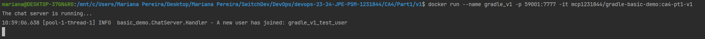

# Class Assignment 4: Containers with Docker - Part 1

## Overview
The goal of this class assignment was to explore Docker by creating docker images and running containers. 
The objective was to run the chat server from the application explored in the Class Assignment 2 Part 1 (source code and 
more information relative to the assignment can be found [**here**](https://github.com/MarianaPereira7/devops-23-24-JPE-PSM-1231844/tree/main/CA2/Part1)), using two different approaches:
* **Version 1:** Create a docker image to execute the chat server, where the application is built when building the docker image;
* **Version 2:** Create a docker image to execute the chat server, where the application is first built in the host computer
and then only the resultant .jar file is copied to the Dockerfile.

The container should be started for both cases and then the client should be run on the host machine and be able to 
connect to the chat server in both versions (which is running in the container).

**Important notes:**
* Main tasks were identified and issues were created in accordance on GitHub. Once the issue was solved,
  it was closed and linked to a specific commit (the web version of GitHub was used);
* The repository containing the report written for this assignment and the auxiliary generated documentation can be found 
[**here**](https://github.com/MarianaPereira7/devops-23-24-JPE-PSM-1231844/tree/main/CA4/Part1).

<br>

Considering this assignment's objectives, the following issues were created (numbers are relative to this assignment and
only, not considering the autogenerated issue numbers by GitHub):

| Issue Number |                             Description                              |
|:------------:|:--------------------------------------------------------------------:|
|    **#1**    | Create docker image, tag it and publish it to Docker Hub - version 1 |
|    **#2**    | Create docker image, tag it and publish it to Docker Hub - version 2 |
|    **#3**    |    Create a readme file and mark the end of the class assignment     |


<br>

---

## Table of Contents

1. [Part 1: Setting Up the Environment and Basic Concepts](#part-1-setting-up-the-environment-and-basic-concepts)
    - [1.1 What is Docker?](#11-what-is-docker)
    - [1.2 Basic Docker Concepts and Commands](#12-basic-docker-concepts-and-commands)
    - [1.3 Create a Docker Hub Repository](#13-create-a-docker-hub-repository)
2. [Part 2: Creating Docker Images](#part-2-creating-docker-images)
    - [2.1 Version 1: Application is Built During Image Build Process](#21-version-1-application-built-during-image-build-process)
    - [2.2 Version 2: Application is Built on the Host Machine](#22-version-2-application-built-on-the-host-machine)
3. [Useful Sources](#3-useful-sources)

---

## Part 1: Setting Up the Environment and Basic Concepts


### 1.1 What is Docker?
Docker is a platform that enables developers to automate the deployment, scaling, and management of applications using 
containerization. Containers are lightweight, standalone, and executable packages that include everything that is essential
to run a piece of software, ensuring that the application runs consistently across different computing environments, 
from development to production.

Some important advantages of using Docker are its portability, isolation, efficiency and scalability.
Docker is portable because runs on any system that supports it. By running a specific application in its own environment,
conflicts between applications can be prevented. In regards to efficiency, containers share the host operating system kernel
and resources, so they become extremely lightweight when compared to virtual machines, taking less time to start up.
Lastly, thinking of scalability, multiple container instances can easily be started to handle increased requests to the 
application, and then shutdown when the load decreases.

Docker can be installed by following this [**link**](https://www.docker.com/products/docker-desktop/).

<br>

### 1.2 Basic Docker Concepts and Commands
Below are explained some basic and important concepts when speaking about Docker:
* **Container:** a sandboxed process running on a host machine that is isolated from all other processes running on that 
host machine. It is a runnable instance of an image.
* **Image:** is a template used to create a docker container. It must contain everything needed to run an application,
all dependencies, configurations, scripts, binaries, ... The image can also contain other configurations for the container, 
such as environment variables, a default command to run, and other metadata.
* **Dockerfile:** text file that contains a series of instructions to build a Docker image. It defines the steps needed 
to assemble the image, specifying the base image, dependencies, configuration settings, and the commands to run within 
the container. In short, a Dockerfile serves as a blueprint for creating Docker images.
* **Registry:** a centralized service where Docker images are stored, managed, and distributed. It serves as a repository 
for Docker images, allowing users to upload and download images for their applications.

Below are pointed some basic commands to know when working with Docker:
    
* To download a docker image from Docker Hub: `docker pull <image name>`;
* To run the image (start the image in a container): `docker run <image name>`;
* To know all the local images: `docker images`;
* To know the status of all running docker containers: `docker ps`;
* To see all the docker containers (running and non-running): `docker ps -a`;
* To run the container on a detached mode: `docker run -d <container ID or name>`;
* To stop / restart a container: `docker stop <container ID or name>` / `docker start <container ID or name>`;
* To pull an image and start it right away in a container: `docker run <image name>:<version>` (equivalent to 
run `docker pull` and then `docker start`).

<br>

### 1.3 Create a Docker Hub Repository
In order to upload images to Docker Hub, an account is needed. Go to the following [**link**](https://hub.docker.com/) and **sign up**.  
After that, select `Create Repository` and fill in the required information, namely the name of the repository, if it is public
(otherwise you would not be able to share images with the community) and, when you are done, select `Create`.
Now, if you would like, you can open a terminal and login to your Docker Hub account, because later in the assignment it
will be required, in order to push the images to the Docker Registry. Run the following command:
```bash
docker login -u YOUR-USER-NAME
```
where `YOUR-USER-NAME` should be replaced by your username. As an example, below is what I did for this assignment, where
`mcp1231844` is my username.
Introduce the password and you should be good to go.


<br>

## Part 2: Creating Docker Images
In this section, it is presented the approaches taken to create and build the images required from the assignment.
A Dockerfile for each image was created and its content is explained. Then the images were built, tagged and pushed to
to Docker Hub, using a Docker Hub account ([section 1.3](#13-create-a-docker-hub-repository)).

<br>

### 2.1 Version 1: Application Built During Image Build Process
The first approach requires for the application to be built during the image build process.
The Dockerfile is present in [this directory](v1). Below it is presented a brief explanation of the relevant instructions.

<br>

**1. Choose the image base:**  
```groovy
FROM openjdk:17-bullseye
```

Official OpenJDK 17 image was chosen as the base image, ensuring that Java 17 is available in the container.
Moreover, this base image also guarantees that git is installed.

<br>

**2. Define the working directory:**   
```groovy
WORKDIR /opt
```
The `/opt` directory is a standard directory on Unix-like operating systems (including Linux) that stands for _optional_ 
or _opt_. It is used for the installation of add-on application software packages. These packages are typically self-contained, 
third-party applications that are not part of the default system installation.
In Dockerfiles, the `/opt` directory is often chosen to be the initial `WORKDIR` for clarity and organization purposes
when installing and running non-system software.
 
<br>

**3. Get source code and build the application:**

```groovy
RUN mkdir gradle_basic_demo

RUN git clone https://github.com/MarianaPereira7/devops-23-24-JPE-PSM-1231844.git gitrepo

WORKDIR gitrepo/CA2/Part1/gradle_basic_demo

RUN chmod +x gradlew && ./gradlew build

RUN cp build/libs/basic_demo-0.1.0.jar /opt/gradle_basic_demo/

WORKDIR /opt/gradle_basic_demo

RUN rm -r /opt/gitrepo
```
In this set of instructions, the git repository containing the source code of the application is cloned to a folder named
`gitrepo`. Then, the application is built with `./gradlew build` inside the folder `gitrepo/CA2/Part1/gradle_basic_demo`.
The resulting .jar file is then copied to `/opt/gradle_basic_demo/` directory. Finally, `gitrepo` folder is deleted, since it
is not longer used.

<br>

**4. Define application's entrypoint:**
```groovy
EXPOSE 7777

ENTRYPOINT ["java", "-cp"]

CMD ["basic_demo-0.1.0.jar", "basic_demo.ChatServerApp", "7777"]
```
The application server container is exposed to the host on port 7777.  
The entrypoint is the command executed by the container on its startup. The default entrypoint is `/bin/sh -c`. In this case,
the entrypoint was overwritten to run java on startup, being the final entrypoint `java -cp`.  
The `CMD` instruction defines the arguments that will be passed to the entrypoint during the container's startup.   
The result command executed by the container will then be:
```bash
java -cp basic_demo-0.1.0.jar basic_demo.ChatServerApp 7777
```

Now it is time to build the image. Navigate to the folder where your Dockerfile is stored and simply run the following command:
```bash 
docker build -t mcp1231844/gradle-basic-demo:ca4-pt1-v1 .
```
Where, in this case, `mcp1231844/gradle-basic-demo` is the name of the Docker Hub repository, `ca4-pt1-v1` the image tag.

<br>

Before effectively pushing the images to the registry, verify that the container starts as expected.
Some considerations regarding the command below:
* `--name` is used to give a name to the container;
* `-p host_Port:container_Port` is used to port forward the container port to the host;
* `-it` is used to have interactive terminal capabilities, in this case, we can see its output in the image below. 

**NOTE:** Run the client on your host machine to fully test the server connection. In the image below, port 59001 on the
host was mapped to port 7777 on the container:



Now that it was verified that the container is running as expected, it is safe to push the image to Docker Hub:
```bash 
docker push mcp1231844/gradle-basic-demo:ca4-pt1-v1
```

<br>

### 2.2 Version 2: Application Built on the Host Machine
The second approach requires for the application to be built on the host machine and then copied to the Dockerfile.
The final Dockerfile is present in [this directory](v2). Below it is presented a brief explanation of the relevant 
instructions (which are similar to the first approach - [section 2.1](#21-version-1-application-built-in-the-dockerfile)).
This version requires less amount of steps, since the .jar file is being copied from the host machine.

<br>

**1. Choose the image base:**
```groovy
FROM openjdk:21-bullseye
```

Official OpenJDK 21 image was chosen as the base image, ensuring that Java 21 is available in the container to run Java
applications. **This version was chosen, because the application was built in the host with that same java version.**

<br>

**2. Define the working directory:**
```groovy
WORKDIR /opt

RUN mkdir gradle_basic_demo

WORKDIR /opt/gradle_basic_demo
```
As in the first approach, the `/opt` directory was used to store the required files. A directory named `gradle_basic_demo`
was created inside the `/opt` directory to further store the .jar file.
Then, the working directory was changed to `/opt/gradle_basic_demo`.

<br>

**3. Copy the .jar file to the intended directory:**
```groovy
COPY CA2/Part1/gradle_basic_demo/build/libs/basic_demo-0.1.0.jar .
```

With this command, the .jar file `basic_demo-0.1.0.jar` is being copied from the CA2/Part1/gradle_basic_demo/build/libs/ directory
on the host machine to the current working directory in the container, which is `/opt/gradle_basic_demo`.

<br>

**4. Define application's entrypoint:**
```groovy
EXPOSE 51515

ENTRYPOINT ["java", "-cp"]

CMD ["basic_demo-0.1.0.jar", "basic_demo.ChatServerApp", "51515"]
```
Similarly to the first approach, the application server container is again exposed to the host but, this time, on port 51515.  
Again, the entrypoint was overwritten to run java on startup, being the final entrypoint `java -cp`.  
The `CMD` instruction defines the arguments that will be passed to the entrypoint during the container's startup, as 
seen in [section 2.1](#21-version-1-application-built-in-the-dockerfile).  
The result command executed by the container will then be:
```bash
java -cp basic_demo-0.1.0.jar basic_demo.ChatServerApp 51515
```

Now it is time to build the image. This time, we need to copy the .jar file from the host to the image, make sure 
that you first navigate to the root folder of the repository and, then run the docker command with the `-f OPTION`
to specify the location of the correct Dockerfile. The `.` is the path that the image will have access to copy files from,
during the build process (which is from the root repository inwards).
```bash 
docker build -t mcp1231844/gradle-basic-demo:ca4-part1-v2 -f CA4/Part1/v2/Dockerfile .
```
Where, in this case, `mcp1231844/gradle-basic-demo` is the name of the Docker Hub repository, `ca4-pt1-v2` the new image
tag for the second approach.

<br>

Again, before effectively pushing the image to the registry, make sure that the container starts as expected.

**NOTE:** Run the client on your host machine to fully test the server connection. In the image below, port 59001 on the 
host was mapped to port 51515 on the container:


Now that it was verified that the container is running as expected, it is safe to push the image to Docker Hub:
```bash 
docker push mcp1231844/gradle-basic-demo:ca4-pt1-v2
```

<br>


---
## 3. Useful Sources
* [What is Docker](https://docs.docker.com/get-started/overview/)
* [Create a repository and push an image](https://docs.docker.com/get-started/04_sharing_app/)
* [Writing a Dockerfile](https://docs.docker.com/guides/docker-concepts/building-images/writing-a-dockerfile/)
* [Publishing and exposing ports](https://docs.docker.com/guides/docker-concepts/running-containers/publishing-ports/)

---
