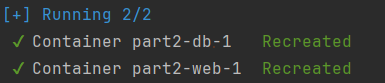

# Class Assignment 4: Containers with Docker - Part 2

## Overview
The goal of this class assignment was to continue exploring Docker, this time by creating a new file known as Docker Compose.
The objective was to develop a similar solution as the one explored in the Class Assignment 3 Part 2 (source code and 
more information relative to the assignment can be found [**here**](https://github.com/MarianaPereira7/devops-23-24-JPE-PSM-1231844/tree/main/CA3/Part2).

**Some requirements:**  
* A docker image should be created with all the information required to run Tomcat and the spring application;
* Another docker image should be prepared with all the required information to execute the H2 server database;
* The container were the database server is running should use a volume for file transfer purposes;
* A Docker Compose file should be configured in order to start both the web and database containers.

**Important notes:**
* Main tasks were identified and issues were created in accordance on GitHub. Once the issue was solved,
  it was closed and linked to a specific commit (the web version of GitHub was used);
* The repository containing the report written for this assignment and the auxiliary generated documentation can be found 
[**here**](https://github.com/MarianaPereira7/devops-23-24-JPE-PSM-1231844/tree/main/CA4/Part2).

<br>

Considering this assignment's objectives, the following issues were created (numbers are relative to this assignment and
only, not considering the autogenerated issue numbers by GitHub):

| Issue Number |                                   Description                                    |
|:------------:|:--------------------------------------------------------------------------------:|
|    **#1**    | Create docker image for the database server, tag it and publish it to Docker Hub |
|    **#2**    |   Create docker image for the web server, tag it and publish it to Docker Hub    |
|    **#3**    |               Create Docker Compose file to start both containers                |
|    **#4**    |        Copy the database file generated in the db container to the volume        |
|    **#5**    |          Create a readme file and mark the end of the class assignment           |


<br>

---

## Table of Contents

1. [Part 1: Create Docker Images For Each Container](#part-1-create-docker-images-for-each-container)
    - [1.1 Docker Image for the Database Server](#11-docker-image-for-the-database-server)
    - [1.2 Docker Image for the Web Server](#12-docker-image-for-the-web-server)
2. [Part 2: Create Docker Compose File and Start the Containers](#part-2-create-docker-compose-file-and-start-the-containers)
3. [Useful Sources](#3-useful-sources)

---

## Part 1: Create Docker Images For Each Container
In this section, it is briefly explained how the images required from the assignment were built, since a similar explanation
and relevant commands were presented in the previous assignment (please refer to [CA4 Part1](../Part1) for more information).
A Dockerfile for each image was created and its content is explained. Then the images were built, tagged and pushed to
to Docker Hub, using a Docker Hub account.

### 1.1 Docker Image for the Database Server

**1. Choose the image base:**  
```groovy
FROM openjdk:17-bullseye
```

Official OpenJDK 17 image was chosen as the base image, ensuring that Java 17 is available in the container.

<br>

**2. Define the working directory:**   
```groovy
WORKDIR /opt/db
```
In Dockerfiles, the `/opt` directory is often chosen to be the initial `WORKDIR` for clarity and organization purposes
when installing and running non-system software. Working directory in set to be `/opt/db`.
 
<br>

**3. Get H2 database server .jar file:**

```groovy
RUN wget https://repo1.maven.org/maven2/com/h2database/h2/1.4.200/h2-1.4.200.jar
```
This command downloads the H2 database .jar file from the Maven Central Repository, and stores it in the current working 
directory of the Docker image `/opt/db`.

<br>

**4. Expose required ports:**
```groovy
EXPOSE 8082

EXPOSE 9092
```
By exposing port 8082, the H2 console can be accessed from the host.
By exposing port 9092, the web application server will be able to connect to the database server.

**4. Expose required ports:**
```groovy
CMD java -cp ./h2*.jar org.h2.tools.Server -web -webAllowOthers -tcp -tcpAllowOthers -ifNotExists > out.txt
```
Specifies the default command to run when the container starts. Briefly, it runs the H2 database server with specific
options to allow external connections and log the output to a file name `out.txt`.

Now it is time to build the image. First create the Docker Hub repository, which is `mcp1231844/spring-basic-tutorial-db`.  
For this assginment, since two Dockerfiles were created, it was decided to put each one in a separate and dedicated folder.  
Navigate to the folder where your Dockerfile is stored and simply run the following command:
```bash 
docker build -t mcp1231844/spring-basic-tutorial-db:ca4-part2 .
```
Where, in this case, `mcp1231844/spring-basic-tutorial-db:` is the name of the Docker Hub repository, `ca4-pt2` the image tag.

Push the image to Docker Hub:
```bash 
docker push mcp1231844/spring-basic-tutorial-db:ca4-part2
```

<br>

### 1.2 Docker Image for the Web Server
**1. The same image base from the previous Dockerfile was chosen:**
```groovy
FROM openjdk:17-bullseye
```
<br>

**2. Define the working directory:**
```groovy
WORKDIR /opt/db
```
In Dockerfiles, the `/opt` directory is often chosen to be the initial `WORKDIR` for clarity and organization purposes
when installing and running non-system software. Working directory in set to be `/opt/web`.  

<br>

**3. Get Apache Tomcat and preserve necessary content:**

```groovy
RUN wget https://dlcdn.apache.org/tomcat/tomcat-10/v10.1.24/bin/apache-tomcat-10.1.24.tar.gz && \
    tar xzvf apache-tomcat-10*tar.gz -C . && \
    chmod -R u+x apache-tomcat-10* && \
    rm apache-tomcat-10*tar.gz
```
This set of commands starts by downloading the Apache Tomcat .tar file and then extracting its contents to the current
working directory `/opt/web`. Then sets execute permissions for the user on all files and directories within the extracted 
Tomcat directory. Finally, removes the .tar file since it will be no longer needed.

<br>

**4. Get application source code:**
```groovy
RUN git clone https://github.com/MarianaPereira7/devops-23-24-JPE-PSM-1231844.git gitrepo && \mkdir react-and-spring-data-rest-basic && \
    cp -r gitrepo/CA2/Part2/react-and-spring-data-rest-basic/* react-and-spring-data-rest-basic/ && \
    chmod u+x react-and-spring-data-rest-basic/gradlew && \
    rm -r gitrepo
```
The repository containing the source code is cloned into a new directory named `gitrepo`. Then a new directory is created
in `/opt/web/react-and-spring-data-rest-basic` and only the relevant content for this assignment was copied to the new folder
(which correspond to `CA2/Part2/react-and-spring-data-rest-basic` source code).
Finally, gradlew permissions are set to be executable and the `gitrepo` directory and all of its content is deleted, since it will be 
no longer needed.

<br>

**5. Build the application and make it available for deployment:**
```groovy
WORKDIR react-and-spring-data-rest-basic

RUN ./gradlew clean build

RUN cp ./build/libs/react-and-spring-data-rest-basic-0.0.1-SNAPSHOT.war /opt/web/apache-tomcat-10*/webapps/
```
Working directory changes to `opt/web/react-and-spring-data-rest-basic` and the project is compiled and packaged to a .war
file, by running the gradle wrapper script. The generated .war file is copied to the `webapps` directory of the
Tomcat server.

<br>

**6. Specify command to run the Tomcat server:**
```groovy
WORKDIR /opt/web

EXPOSE 8080

CMD ./apache-tomcat-10*/bin/catalina.sh run
```
Working directory gets changed again to `/opt/web` and the port 8080 is exposed for host connections.
The final `CMD` specifies the default command to run when the container starts. It runs the Tomcat server using the `catalina.sh`
script with the run argument, which starts the Tomcat server in the foreground. This command was taken by consulting the Apache
Tomcat image on Docker Hub, where any available Dockerfile has the above command as the entry point of the container 
(please refer to this [link](https://hub.docker.com/_/tomcat/tags)).


Another Docker Hub repository was created, since the generated images serve different purposes. In this case, the new 
repository is `mcp1231844/spring-basic-tutorial-web`.  
As mentioned before, it was decided to put each one of the Dockerfiles in a separate and dedicated folder.  
Navigate to the folder where your Dockerfile is stored and simply run the following command:
```bash 
docker build -t mcp1231844/spring-basic-tutorial-web:ca4-part2 .
```
Where, in this case, `mcp1231844/spring-basic-tutorial-web:` is the name of the Docker Hub repository, `ca4-pt2` the image tag.

Push the image to Docker Hub:
```bash 
docker push mcp1231844/spring-basic-tutorial-web:ca4-part2
```

<br>

## Part 2: Create Docker Compose File and Start the Containers
In order to start up both containers simultaneously and connect them together, a Docker Compose file was created.  
A Docker Compose file, typically named docker-compose.yml, is a YAML file that defines and manages multi-container Docker applications. 
Using a Docker Compose file, you can specify how different services (containers) in your application should be built, configured, 
and linked together. Below are the main components of a Docker Compose file and some comments regarding this assignment.

* **Version:** Specifies the version of the Docker Compose file format. Version 3 was used in this CA.  
  

* **Services:** Defines the individual services (containers) that make up the application. In this CA, `db` and `web` services were used.
  

* **Image:** Specifies the Docker image to use for each service. 
  

* **Build:** Specifies the build context for each service, which is the directory `db` and `web` for the database and web server,
respectively. Each one of this directories contains the corresponding Dockerfile.
  

* **Ports:** Maps ports between the host and the container. In this case, also establishes the connection between the database
and the server by specifying the `DATABASE_IP` and `DATABASE_PORT`.
  

* **Volumes:** Mounts host directories or named volumes into the container. This was done for the db container, where a shared_db folder
was created in `./db/shared_db`, considering the location of the Docker Compose file. A folder `/opt/db/shared_db` is going to be mounted inside
the container once it starts up.
  

* **Environment:** Sets environment variables for the container. In this case, and as mentioned before, db service should 
be used by the web container for database connections and that the database server is running on port 9092.  
  

* **Depends_on:** Specifies dependencies between services, controlling the startup order. In this case, it is guaranteed that the
db services starts before the web service, otherwise, due to application.properties configuration file, some errors would be
faced, since there was no available database.  
  

* **Networks:** Defines custom networks, allowing for the services to communicate with each other using their service names as hostnames,
which is why is it possible to configure the `DATABASE_IP` as `db`, the web server does not need to know its IP address explicitly, 
making service discovery and communication straightforward and manageable.

The complete Docker Compose file can be found in [here](./docker-compose.yml).

Now, by simply running `docker-compose up` both containers are created and started up, use `docker ps` to check all the running
containers.




<br>

The connection of the web container to the database server is also verified by viewing the logs of the web container with
the command `docker-compose logs web`:


<br>

Finally, as requested in this assignment, to copy the generated database file from the db container to the host machine, 
you can run the following command:
```bash
docker exec part2-db-1 cp /opt/db/jpadb.mv.db /opt/db/shared_db/jpadb.mv.db
```
This runs a command inside the db container (which must be running), where `part2-db-1` is the name given to the container.
The command is copying the database file `jpadb.mv.db` to the directory `/opt/db/shared_db` also inside the container,
which was mounted by the host. Now, this file should also be available in the host machine on `./db/shared_db` (path relative to the
Docker Compose file).  


**Note:** Do not forget to reference this type of files in `.gitignore` file.


<br>


---
## 3. Useful Sources
* [Use Docker Compose](https://docs.docker.com/get-started/08_using_compose/)


---
