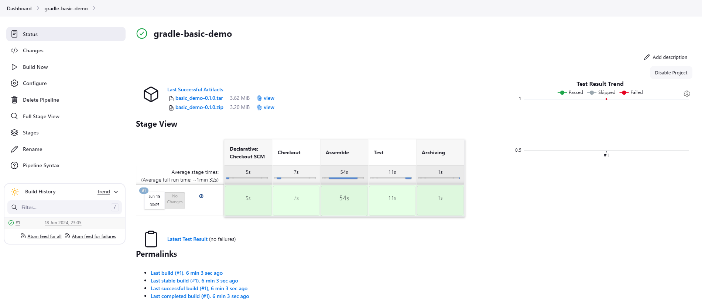

# Class Assignment 5: CI/CD Pipelines with Jenkins

## Overview
The goal of this class assignment was to learn and explore Jenkins. To support the assignment, the code developed on the previous
Class Assignment 2 (both part 1 and 2) was used and can be found [**here**](https://github.com/MarianaPereira7/devops-23-24-JPE-PSM-1231844/tree/main/CA2).
The main goal was to learn how to create and execute pipelines.

**Assignment Requirements:**
* Create a pipeline in Jenkins to build the gradle basic demo application (developed in CA2, Part1);
* Create a pipeline in Jenkins to build the tutorial spring boot application (developed in CA2, Part2);
* Each pipeline has its own mandatory stages (presented and explained throughout this report).


**Important notes:**
* Main tasks were identified and issues were created in accordance on GitHub. Once the issue was solved,
  it was closed and linked to a specific commit (the web version of GitHub was used);
* The repository containing the report written for this assignment and the auxiliary generated documentation can be found
  [**here**](https://github.com/MarianaPereira7/devops-23-24-JPE-PSM-1231844/tree/main/CA5).

<br>

---

## Table of Contents

1. [Part 1: Jenkins In a Nutshell](#part-1-jenkins-in-a-nutshell)
    - [1.1 What is Jenkins?](#11-what-is-jenkins)
    - [1.2 How Does Jenkins Work?](#12-how-does-jenkins-work)
2. [Part 2: Create Jenkins Pipelines](#part-2-create-jenkins-pipelines)
    - [2.1 Pipeline for Gradle Basic Demo Application](#21-pipeline-for-gradle-basic-demo-application)
    - [2.2 Pipeline for Spring Boot Application Tutorial](#22-pipeline-for-spring-boot-application-tutorial)
3. [Useful Sources](#3-useful-sources)

---

## Part 1: Jenkins In a Nutshell

### 1.1 What is Jenkins?
Jenkins is an open source continuous integration/continuous delivery and deployment (CI/CD) automation software DevOps tool 
written in the Java programming language. It is used to implement CI/CD workflows, called pipelines.
  
**Pipelines** automate testing and reporting on isolated changes in a larger code base in real time and facilitates the 
integration of disparate branches of the code into a main branch. They also rapidly detect defects in a code base, build 
the software, automate testing of their builds, prepare the code base for deployment (delivery), and ultimately deploy 
code to containers, virtual machines, bare metal or cloud servers.  

Over time, **continuous delivery** and **deployment** features have been added to Jenkins.   
**Continuous delivery** is the process of 
automating the building and packaging of code for eventual deployment to test, production staging, and production environments. 
**Continuous deployment** automates the final step of deploying the code to its final destination.

<br>

### 1.2 How Does Jenkins Work?
Jenkins runs as a server on a variety of platforms including Windows, MacOS, Unix variants and especially, Linux. 
It requires a Java 8 VM and above and can be run on the Oracle JRE or OpenJDK. Usually, Jenkins runs as a Java servlet 
within a Jetty application server, but it can also be run on other Java application servers such as Apache Tomcat.  
**In the
last years, Jenkins has been adapted to run in a Docker container, which is the approach taken for this assignment.** 
There are read-only Jenkins images available in the Docker Hub online repository.

To operate Jenkins, **pipelines** are created. A **pipeline** is a series of steps the Jenkins server will take to perform the 
required tasks of the CI/CD process. These are stored in a plain text Jenkinsfile. This file uses a curly bracket 
syntax that looks similar to a JSON. Steps in the pipeline are declared as commands with parameters and encapsulated in 
curly brackets. The Jenkins server then reads the Jenkinsfile and executes its commands, pushing the code down the pipeline 
from committed source code to production runtime.  

One of the advantages of Jenkins is that it can be extended using **plugins**, which are enhancements to the Jenkins system.
They help extend Jenkins capabilities and integrated Jenkins with other software. Plugins can be downloaded from the online 
Jenkins Plugin repository and loaded using the Jenkins Web UI or CLI. This makes Jenkins more flexible and adaptable to 
changes in IT environments.

Jenkins is not perfect. While it is easy to install, production Jenkins can be difficult to implement. Developing 
production pipelines using Jenkinsfiles requires coding in either its declarative or scripting language. Complex pipelines, 
especially, can be difficult to code, debug and maintain.

<br>

## Part 2: Create Jenkins Pipelines

### 2.1 Pipeline for Gradle Basic Demo Application
For this part, a pipeline was created with 4 stages defined: **Checkout, Assemble, Test** and **Archive**.   
To immediately start running Jenkins on a container, start the Docker Engine and run the command below on a terminal:
```bash
docker run -d -v ./jenkins_home:/var/jenkins_home -p 8080:8080 -p 50000:50000 --restart=on-failure jenkins/jenkins:lts-jdk17
```
where:
- `-d` is used to run the container in detached mode, i.e. as a background process;
- `-v ./jenkins_home:/var/jenkins_home` mounts a local volume called `jenkins_home` to the container's `/var/jenkins_home` directory.
  `/var/jenkins_home` is a real directory inside the container which is binded with the `jenkins_home` folder in the host. This
  volume is important for data persistency. If we remove/restart the container, the data will still be in the mounted volume,
  otherwise, without this data, Jenkins would have to be reinitialized;
- `-p 8080:8080` is exposing the ports. Jenkins will run at port 8080 inside the container, because Jenkins runs on Tomcat, 
which by default runs on this port;
- `-p 50000:50000` maps the ports where Jenkins master and slaves communicate (in case we had some slaves, which is not 
the case for this assignment);
- `--restart=on-failure` configures the container to automatically restart if it exits due to an error;
- `jenkins/jenkins:lts-jdk17` is the Docker image to use, which refers to the Jenkins LTS (Long Term Support) version with JDK 17.  

  
Now that the container is running, open a browser and type `localhost:8080` to access Jenkins. An initial configuration 
is required, so get the initial password by running the command below. Copy the output and use it for the configuration.
Proceed with the installation of the recommended plugins and configure username and password as desired.
```bash
docker exec <containerID> -- cat /var/jenkins_home/secrets/initialAdminPassword
```

<br> 

It is time to create the **Jenkinsfile** defining all the stages required and mentioned above (Checkout, Assemble, Test and Archive).  
All the stages will be separately shown below as well as a brief explanation. To view the complete Jenkinsfile, please refer
to [this link](./Part1/Jenkinsfile).

- **Checkout:**
```groovy
stage('Checkout') {
    steps {
         echo 'Checking out...'
         dir('devops-23-24-JPE-PSM-1231844'){
            git branch: 'main',
                url: 'https://github.com/MarianaPereira7/devops-23-24-JPE-PSM-1231844'
         }
    }
}
```
In this stage, the Git repository containing the source code is cloned from the specified URL to the local workspace.
The dir block ensures that the repository is cloned into a specific directory `devops-23-24-JPE-PSM-1231844`.

<br>

- **Assemble:**
```groovy
stage('Assemble') {
    steps {
        echo 'Assembling...'
        dir('devops-23-24-JPE-PSM-1231844/CA2/Part1/gradle_basic_demo/'){
            sh 'chmod +x gradlew'
            sh './gradlew assemble'
        }
    }
}
```
In this stage, first is required to navigate to the directory where the Gradle project is located. Then, execution permissions are
given to the gradle wrapper script `gradlew` executable. Assemble task is then executed, which compiles the code.

<br>

- **Test:**
```groovy
stage('Test') {
    steps {
        echo 'Running Unit Tests...'
        dir('devops-23-24-JPE-PSM-1231844/CA2/Part1/gradle_basic_demo') {
            sh './gradlew test'
            junit 'build/test-results/*/*.xml'
        }
    }
}
```
In this stage, it is again required to navigate to the directory where the Gradle project is located, because when switching stages,
it does not automatically continue from the directory where the previous stage ended. Each stage in a Jenkins pipeline 
typically starts in the workspace root directory of the job.
Test task in then executed to run the unit tests and publish the resultant test results from the `build/test-results/` directory.

<br>

- **Archive:**
```groovy
stage('Archiving') {
    steps {
        echo 'Archiving...'
        dir('devops-23-24-JPE-PSM-1231844/CA2/Part1/gradle_basic_demo'){
            archiveArtifacts 'build/distributions/*'
        }
    }
}
```
In this stage, it is again required to navigate to the directory where the Gradle project is located and then archives 
the distribution files (which were created by the **assemble task** run on the **Assemble Stage**) using the
`archiveArtifacts` step, so they are stored and accessible within Jenkins.

Now that the pipeline is defined in the Jenkinsfile, commit your work to your repository and go to Jenkins to create your first
pipeline by following the steps below:
1. In the main page, click on `New Item`;
2. Choose a name for the pipeline, select the pipeline option and then click the OK button;
3. In the pipeline settings, under pipeline `Definition`:
   - select pipeline script from SCM (source control management) (you can specify Git under SCM options, but it is not mandatory);
   - add the repository URL to `Repository URL`;
   - select a branch where Jenkins should look for the Jenkinsfile (the one you have just produced);
   - add the location of the Jenkinsfile in the repository to the `Script Path` field (consider the relative path).
   - click `Save` at the end (you will be automatically redirected to the pipeline's main page).
  
**NOTE:** For this pipeline, no credentials were needed since the repository is configured as public. In case you are working
with a private repository, credentials are required (more on that on the next section).


In order to have a friendlier representation of the pipeline execution, it is recommended to install the Stage View Plugin.
Go to `Dashboard > Manage Jenkins > Plugins (in System Configuration)> Available plugins` and type `Stage View Plugin` to install.  
Return to your pipeline main page `Dashboard > <your-pipeline>` and click on `Build Now` to start its execution (it might 
take several minutes for the execution to complete, specially if it is the first time running the pipeline).
A similar result as displayed in the image below should be obtained on the `Status` section:



Since the Stage View Plugin was previously installed, a `Stage View` with all the stages and the required time to execute 
each one should be displayed. In case any box is red, it means that the pipeline execution did not succeed (to identify 
any errors, you can check the console output). You can also see the archived artifacts under `Last Successful Artifacts`.

<br>

### 2.2 Pipeline for Spring Boot Application Tutorial
The goal of this part was very similar to the previous one, create a pipeline with some required stages.
On top of previous pipeline stages, a stage to create the **Javadoc** documentation, another to **Generate** a docker image (with Tomcat and the war 
file of the application) and a final stage to **Publish** the docker image to Docker Hub.
**For the last two stages (generate and publish a docker image), it is mandatory for the Container which is running Jenkins
to be capable of running docker commands.** There are a few approaches that can be followed, below it is the explanation of the
chosen one.

A Dockerfile was created with a base image of Jenkins official image and the following packages were installed (docker, sudo, 
nodejs, npm).
```groovy
FROM  jenkins/jenkins:lts-alpine-jdk17

USER root

RUN apk add --update docker sudo nodejs npm

RUN echo "jenkins    ALL=NOPASSWD: ALL" > /etc/sudoers.d/jenkins

USER jenkins

EXPOSE 8080
```
Moreover, a configuration file was added to the `sudoers.d` directory that allows the jenkins user to execute any 
commands without needing a password. This is necessary because Jenkins often requires elevated privileges to run certain commands.
Then switches back to the jenkins user for running Jenkins, ensuring that the Jenkins service runs with non-root privileges,
which is a good security practice. Finally, port 8080 is exposed, informing Docker where the container will be listening on at runtime.
This is the default port where Jenkins' web interface is accessible.

Build the image and then run your container. The same command as shown in the previous [section](#21-pipeline-for-gradle-basic-demo-application)
was used, with an extra mount, in order to run Docker commands inside the Jenkins container. **This mount is the Host docker daemon socket.**

**Notes:** 
1. This approach might not be the best practice, since we are giving the container permission to shutdown itself. However,
since this pipeline is only be created for test purposes and local pipelines, it is a simpler approach.

2. Make sure that you first stop the previous container before running the command below, since the mapped ports are already in use!**
3. After running the command below, the container is ready to run docker commands. Be sure to use sudo to avoid constrains 
of the Jenkins' user permissions.
```bash
docker run -d -v /var/run/docker.sock:/var/run/docker.sock  -v ./jenkins_home:/var/jenkins_home -p 8080:8080 -p 50000:50000 --restart=on-failure jenkins:jdk17-local
```
where `jenkins:jdk17-local` is the name given to the previously generated docker image).  
  
Next step is to create a new Jenkinsfile to define the pipeline stages. However, since this time Jenkins will need to access
Docker Hub to publish the generated image, let's first create the required credentials.  
In Jenkins go to
`Dashboard > Manage Jenkins > Credentials (on Security)` click on `(global)` and then `+ Add Credentials`.  
Right your Docker Hub username, password, the ID to identify this set of credentials and a brief description (optional),
and then click on `Create` in the end.


<br>

Now everything is ready, start defining your new pipeline. Create a new Jenkinsfile on another folder of your project.  
As in the previous section, the stages are shown below with a brief explanation. To view the complete Jenkinsfile, please refer
to [this link](./Part2/Jenkinsfile).

The first 3 stages are exactly the same as the previous ones defined in the first pipeline (Checkout, Assemble, Test).
The only difference is the targeted directory, which now should be `devops-23-24-JPE-PSM-1231844/CA2/Part2/react-and-spring-data-rest-basic`.

- **Javadoc:**
```groovy
stage('Javadoc') {
    steps {
        echo 'Creating Javadoc...'
        dir('devops-23-24-JPE-PSM-1231844/CA2/Part2/react-and-spring-data-rest-basic') {
            sh './gradlew javadoc'
            publishHTML (target : [
                    allowMissing: false,
                    alwaysLinkToLastBuild: true,
                    keepAll: true,
                    reportDir: 'build/docs/javadoc',
                    reportFiles: 'index-all.html',
                    reportName: 'Javadoc',
                    reportTitles: 'react-and-spring-data-rest-basic'
            ])
        }
    }
}
```
In this stage, the javadoc task is run to generate documentation, and then it is published in Jenkins using the publishHTML step.
**Note:** It is required to install the HTML Publisher Plugin on Jenkins. 

<br>

- **Archive:**
```groovy
stage('Archiving') {
    steps {
        echo 'Archiving...'
        dir('devops-23-24-JPE-PSM-1231844/CA2/Part2/react-and-spring-data-rest-basic'){
            archiveArtifacts 'build/libs/*.war'
        }
    }
}
```
In this stage, the war file generated during the `assemble` stage is archived.

<br>

- **Build Docker Image:**
```groovy
stage('Build Docker Image') {
    steps {
        echo 'Building Docker Image...'
        dir('devops-23-24-JPE-PSM-1231844/CA2/Part2/react-and-spring-data-rest-basic') {
            // Copy the WAR file into the Docker build context
            sh 'cp build/libs/react-and-spring-data-rest-basic-0.0.1-SNAPSHOT.war .'

            // Dynamically generate Dockerfile
            script {
                def dockerfileContent = """
                        FROM tomcat:10.0.20-jdk17-temurin

                        COPY *.war /usr/local/tomcat/webapps/
                        """
                writeFile file: 'Dockerfile', text: dockerfileContent
            }

            script {
                sh 'sudo docker build . -t ${dockerImageRepo}'
            }
        }
    }
}
```
The following environment variable was added in the beggining of the Jenkinsfile:
```groovy
environment {
    dockerImageRepo='mcp1231844/spring-basic-tutorial-web-jenkins:ca5-part2'
}
```
In this stage, the war file is copied from the build output to the current directory, to be included in the Docker image.
Then, a Dockerfile is dynamically created to build the docker image. It is specified the base image (Tomcat with JDK 17) 
and the war file is copied into the Tomcat webapps directory.  
Finally, Docker is used to build the image from the Dockerfile created in the previous step. The image is tagged with 
the name specified in the defined `dockerImageRepo` environment variable.

<br>

- **Publish Docker Image:**
```groovy
stage('Push Docker Image') {
    steps {
        echo 'Pushing Docker Image...'
        withCredentials([usernamePassword(credentialsId: 'docker-hub-login', usernameVariable: 'DOCKER_USERNAME', passwordVariable: 'DOCKER_PASSWORD')]) {
            sh 'sudo docker login -u $DOCKER_USERNAME -p $DOCKER_PASSWORD'
            sh 'sudo docker push ${dockerImageRepo}'
        }
    }
}
```
In this stage, the Jenkins credentials are used to securely log in to Docker Hub, this credentials are stored in Jenkins 
and accessed via the `withCredentials` block (the credentials created before). Finally, the container logs in to 
Docker Hub using the provided credentials and pushes the docker image - Credentials Binding Plugin is being used.

<br>

Finally, create a new pipeline item in Jenkins, the same way as done in the previous [section](#21-pipeline-for-gradle-basic-demo-application),
but now change the `Script Path` to the proper one, in my case, it was `CA5/Part2/Jenkinsfile` instead of `CA5/Part1/Jenkinsfile`.

Execute the pipeline and if everything works fine, a Stage View should be seen with all stages with green color:  


Checking your Docker Hub repository, the published image should also be there:  


<br>

---
## 3. Useful Sources
* [What is Jenkins](https://www.techtarget.com/searchsoftwarequality/definition/Jenkins)
* [Official Jenkins Docker image](https://github.com/jenkinsci/docker)
* [Git plugin](https://www.jenkins.io/doc/pipeline/steps/git/#git-git)
* [Stage View Plugin]()
* [HTML Publisher Plugin](https://plugins.jenkins.io/htmlpublisher/)
* [Credentials Binding Plugin](https://www.jenkins.io/doc/pipeline/steps/credentials-binding/)


---
